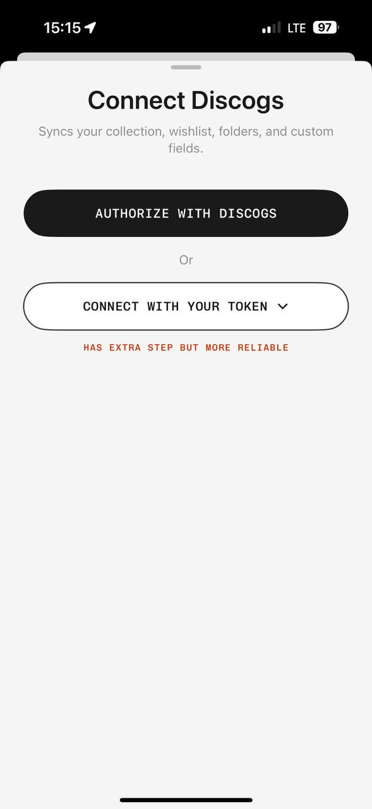

# Auth reference 01 — Login / registration

Reference source: **MyPlastic / Plastic**

Status: **REFERENCE APPROVED FOR AUTH DIRECTION**
Scope: визуальный референс для будущих экранов входа и регистрации bidplace
Platform: mobile
Source file: `auth-login-mobile-reference-01.png`
Image size: 589 × 1280 px
Implementation status: **Not implemented**



Это первый согласованный визуальный референс для auth-flow. Он задаёт направление композиции, типографики, кнопок и плотности, но не является готовым экраном bidplace и не переносится механически. Тексты, действия и состояние авторизации должны соответствовать продукту bidplace.

## Арт-директорский вывод

Сила референса — в дисциплине: один смысловой экран, почти монохромная поверхность, одна чёткая primary action, одна альтернативная action и много воздуха. Кнопки кажутся объёмными не из-за теней или градиентов, а из-за большой высоты, pill-радиуса, контраста и уверенной типографики. Это хороший ориентир для современного, спокойного и понятного bidplace auth-flow.

## Разбор основных элементов

### 1. Композиция

- Чёрный верхний участок оставляет системный status bar в нативном контексте.
- Основной контент находится внутри светлого rounded sheet, который входит снизу и имеет drag handle.
- Заголовок, пояснение, primary action, разделитель `Or`, secondary action и короткая accent-подсказка образуют одну вертикальную колонку.
- Контент начинается близко к верхней части sheet; нижняя часть намеренно почти пустая.
- Визуальный фокус сразу попадает на заголовок и первый чёрный CTA.

Для bidplace подходит вариант с одной auth-задачей на экране: войти или создать аккаунт. Не следует добавлять сюда навигацию каталога, промо-карточки, trust badges, социальную ленту или лишние ссылки.

### 2. Типографика

- Заголовок — крупный нейтральный sans serif, bold, без декоративности.
- Описание — тот же sans serif меньшего размера и мягкого серого цвета.
- CTA — моноширинный uppercase label с увеличенным tracking; он создаёт editorial/technical характер.
- Accent-пояснение — короткая uppercase mono-строка, не основной текст.

Для bidplace стоит сохранить контраст ролей: обычный sans для объяснения и mono для коротких действий, статусов и технических подписей. Длинные юридические тексты, email и пароль не должны быть mono.

### 3. Фотографии и изображения

В этом auth-референсе фотографий нет — экран сознательно не конкурирует с действием входа.

Для bidplace это означает:

- не добавлять изображение предмета на login/register без продуктовой причины;
- не использовать случайный hero image, который отвлекает от формы;
- при необходимости можно использовать маленький wordmark/mark в shell, но не декоративную фотогалерею;
- изображения предметов должны появляться после auth в discovery/detail-flow, где они объясняют ценность.

### 4. Сетка и отступы

- Узкая одиночная колонка с равными боковыми полями.
- Кнопки почти на всю доступную ширину sheet.
- Между заголовком и описанием — компактный gap; между описанием и CTA — заметный breathing room.
- Между двумя способами действия — явный разделитель и достаточный вертикальный интервал.
- Большое свободное пространство ниже actions снижает ощущение формы-анкеты и делает экран спокойнее.

Target для bidplace: начать с текущего Modern UI mobile gutter 20–24 px, затем проверить реальный keyboard/safe-area layout. Не фиксировать высоты и интервалы только по пикселям этого скриншота.

### 5. Форма элементов

- Primary button — высокий, чёрный, полностью rounded, без видимой тени.
- Secondary button — такой же размер и радиус, но светлая поверхность с тонкой тёмной обводкой.
- Sheet — большой верхний radius и тонкий drag handle.
- Divider — это текстовый `Or`, а не дополнительная графическая линия.
- Chevron внутри secondary action показывает раскрытие следующего шага.

Для bidplace важно не имитировать «3D»-кнопку тенью. Объём создаётся размером, контрастом, radius и press-state. Кнопка должна иметь loading, disabled, focus-visible и error states.

### 6. Визуальная плотность

Плотность низкая. На экране мало элементов, но каждый имеет ясную роль. Это подходит для входа и регистрации: пользователь не должен разбираться в интерфейсе перед первым действием.

Не переносить эту плотность на каталог или product detail буквально: там должны быть видимы предмет, автор, история, provenance и аукционные данные.

### 7. Навигация

Референс не показывает глобальную навигацию. Это task-focused surface, похожая на modal/sheet flow. Для bidplace auth допустим минимальный shell:

- back/close только если экран открыт поверх существующего маршрута;
- wordmark или mark — опционально и компактно;
- переключение `Войти` / `Регистрация` должно быть текстовым и понятным;
- после успешной auth — явный возврат в продуктовый маршрут.

Не добавлять desktop sidebar, bottom tab bar или каталог на auth-экран.

## Что подходит bidplace

- спокойная почти чёрно-белая палитра;
- один главный сценарий на экран;
- крупные rounded controls;
- primary/secondary action в одной визуальной системе;
- mono для коротких CTA и status labels;
- много воздуха и отсутствие декоративного шума;
- progressive disclosure для дополнительных способов входа;
- понятный контраст между главным и альтернативным действием.

## Что не подходит bidplace без адаптации

- текст и модель подключения стороннего сервиса вместо реального bidplace auth-flow;
- длинный технический helper text, если он не помогает войти или зарегистрироваться;
- красный/orange accent как постоянный декоративный цвет;
- sheet-поведение на desktop без проверки контекста маршрута;
- отсутствие видимых label/error/focus states у email и password;
- копирование iOS status bar и системного окружения на web;
- отсутствие ссылки на правила, приватность или восстановление доступа там, где этого требует продуктовый flow.

## Target auth wireframe for future design work

```text
Auth surface / optional back
  bidplace mark or wordmark
  Войти или создать аккаунт
  Короткое человеческое объяснение
  Email
  Пароль / одноразовый код по состоянию flow
  PrimaryButton: Войти / Создать аккаунт
  TextButton: Забыли пароль? или Переключиться на регистрацию
  Secondary path only when it is a real supported method
  Rules/privacy copy near submit, without visual noise
```

This wireframe is a future design direction, not an implementation instruction. Final auth behavior remains owned by the product contract and current route requirements.

## Status and next step

Reference is approved as the first visual direction for login/registration. It does **not** approve final tokens, exact font files, auth copy, route behavior, or a complete `DESIGN.md`. Those should be consolidated only after the remaining design references and founder/designer decisions are reviewed.
