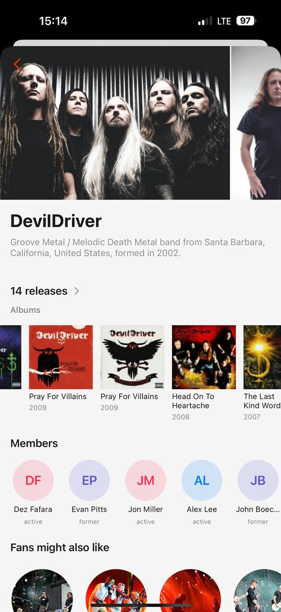

# MyPlastic reference 08 — author profile and partial-image composition

Reference source: **MyPlastic / Plastic**
Status: **REFERENCE APPROVED FOR AUTHOR PROFILE, IMAGE OFFSET AND RELATED WORKS DIRECTION**
Scope: визуальный референс для author/seller profile, horizontal image composition, compact description и related works bidplace
Platform: mobile
Source file: `myplastic-author-profile-mobile-reference-01.png`
Image size: 589 × 1280 px
Implementation status: **Not implemented**

## Арт-директорский вывод

Экран очень экономно использует пространство. В нём нет отдельной галереи с кнопками влево/вправо: большая первая фотография занимает основной фокус, а следующая фотография видна сбоку как продолжение ленты. Это создаёт ощущение монолитной visual story и сразу показывает, что контент можно листать.

Ниже идут короткое описание автора, один ясный переход ко всем работам, rail с работами, members и related creators. Каждый блок имеет собственную роль, поэтому страница не выглядит перегруженной.

## Разбор основных элементов

### 1. Partial-image hero

- Hero image почти на всю ширину экрана, но справа оставлена видимая часть следующего изображения.
- Offset показывает горизонтальное продолжение без arrows и дополнительных controls.
- Back button находится поверх hero в верхнем левом углу и использует тонкий accent icon.
- Изображения выглядят как единая лента, а не как набор отдельных карточек в галерее.
- Кадрирование сохраняет лица и групповую композицию, поэтому фотография одновременно рассказывает о человеке и создаёт visual identity.

Для bidplace это подходит на author/seller profile, product gallery preview и curated collection. На product detail можно показывать partial next image, если swipe behavior очевиден и не мешает primary bid CTA. Для простой `AuctionCard` лучше оставить одно изображение, чтобы карточка была сканируемой.

### 2. Автор и короткое описание

- Большой bold sans title занимает одну смысловую строку/блок.
- Под ним — короткое серое описание в 2–3 строки.
- Описание сообщает жанр, географию и год, то есть даёт context без длинной биографии.

Для bidplace это хороший pattern seller header: имя автора, короткая связь с предметом, город/категория/год — только подтверждённые и публичные данные. Не помещать длинную story в hero; полная история должна открываться ниже или во вкладке.

### 3. Переход `14 releases →`

- Число и label образуют крупный короткий link.
- Arrow стоит в одной строке и ощущается продолжением текста.
- Он не выглядит как отдельная button-card и не создаёт лишний control.
- Число сразу даёт ощущение масштаба коллекции.

Для bidplace аналогичны `14 работ →`, `6 аукционов →`, `3 завершённые продажи →` — только если число реально поддержано API. Стрелка должна вести к полному списку автора, а не быть декоративной.

### 4. Works rail

- Заголовок категории короткий: `Albums`.
- Ниже — горизонтальный ряд квадратных изображений.
- Под изображением — title и маленькая серая metadata строка (год/автор).
- Видна часть следующей работы, чтобы сообщить о scroll.
- Текст ограничен и допускает truncation, иначе row быстро потеряет ритм.

Для bidplace это паттерн `AuthorWorksRail` или `AuctionCard` compact variant: предметы автора, завершённые работы, активные аукционы. Авторская строка может быть скрыта внутри profile, но цена/status должны появляться там, где они помогают выбору.

### 5. Members и related creators

- Members представлены круглыми цветными avatar/initials, а не большими фотографиями.
- Под кругом — имя и muted status `active/former`.
- `Fans might also like` использует ещё один horizontal image rail, но с круглыми/мягкими photo crops.
- Related block появляется ниже основной информации и не перебивает автора.

Для bidplace members можно адаптировать к collaborators, creator team или provenance participants, только если эти данные реальны и публичны. `Fans might also like` может стать `Похожие авторы` или `Вам может быть интересно`, но связь должна быть объяснима: категория, стиль, история или curator selection.

### 6. Сетка и плотность

- Каждый блок имеет короткий heading и один visual pattern.
- Между hero, description, works, members и related block есть заметные vertical gaps.
- Страница остаётся плотной по данным, но не плотной визуально.
- Отсутствуют большие панели, badges и повторяющиеся CTA.

Для bidplace это подходящий rhythm для seller profile. На author page нужно показывать происхождение и работы, но постепенно — через progressive disclosure, а не весь профиль одной длинной таблицей.

## Что подходит bidplace

- partial-image horizontal hero без стрелок;
- свайп как основной способ просмотра серии фото;
- большая фотография автора/предмета как visual identity;
- короткое серое описание под title;
- переход `N работ →` со стрелкой в одной строке;
- related works в Pinterest-like horizontal rail;
- круги для collaborators/participants только при реальном scope;
- спокойная вертикальная композиция без лишних элементов.

## Что не подходит bidplace без адаптации

- копирование музыкальной модели `releases/albums/fans`;
- partial image там, где пользователь ожидает отдельный control или detail CTA;
- скрытие автора и provenance за декоративным hero;
- цифры работ без server-backed count;
- related creators без объяснимой связи;
- обрезка изображения, которая скрывает дефекты или важные детали предмета;
- использование partial cards на всех экранах, где нужна высокая точность выбора.

## Target mapping for bidplace

| MyPlastic pattern | bidplace adaptation |
| --- | --- |
| Band hero | Seller/creator profile hero |
| Partial next photo | Horizontal `AppImage` rail with swipe affordance |
| Short band description | Public seller summary / item context |
| `14 releases →` | `N работ →` / `N аукционов →` |
| Albums rail | Author’s products/works rail |
| Members | Collaborators/provenance participants, if public |
| Fans might also like | Similar creators/items with honest relation |
| Back icon over image | `BackButton` with accessible label |

## Status

Референс утверждён для author profile composition, partial-image hero, compact description, count-to-list link и related works. Он не утверждает музыкальные термины, конкретные seller fields, collaborator model или финальные image ratios bidplace.
