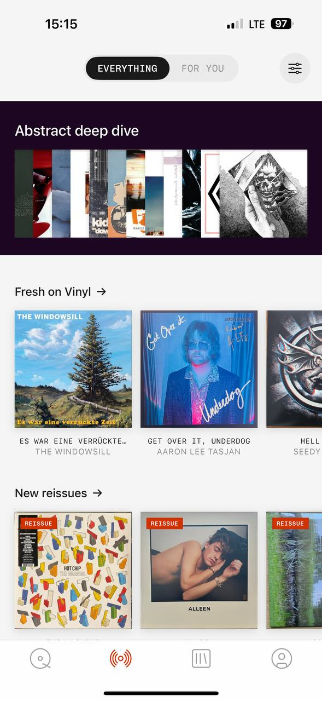

# MyPlastic reference 06 — image-first catalog and editorial labels

Reference source: **MyPlastic / Plastic**
Status: **REFERENCE APPROVED FOR CATALOG COMPOSITION, METADATA AND RARE ACCENT LABELS**
Scope: визуальный референс для discovery sections, auction/product cards, category arrows и announcement labels bidplace
Platform: mobile
Source file: `myplastic-catalog-mobile-reference-01.png`
Image size: 589 × 1280 px
Implementation status: **Not implemented**

## Дополнительное наблюдение к референсу

Новое присланное изображение не добавляется в каталог отдельным файлом по просьбе владельца; оно дополняет этот reference.

В нём подтверждены два важных акцентных приёма:

- `PRESSED AT` под названием и автором — маленькая оранжевая temporal metadata line. Она выделяет дату/событие, но не конкурирует с названием.
- Маленькая чёрная точка у filter icon — компактный сигнал важного состояния, например активных фильтров. Точка должна быть только дополнением к accessible state и текстовому описанию.

Для bidplace эти приёмы можно адаптировать к `СОЗДАНО`, `ДОБАВЛЕНО`, `ВЫСТАВЛЕНО`, `ЗАКАНЧИВАЕТСЯ` или `PRESSED AT`-подобной технической дате только при наличии реального значения. Оранжевый остаётся редким semantic accent, а не украшением всех карточек.

## Арт-директорский вывод

Это сильный референс для главной ленты: сначала короткие editorial sections, затем крупные изображения, а под ними — спокойная серая metadata-строка. Контент выглядит визуально богатым, но интерфейс остаётся минимальным, потому что текст не конкурирует с изображениями.

Особенно полезны два приёма для bidplace: стрелка, встроенная в заголовок категории, и редкий оранжевый label `REISSUE`, который выделяет особый статус, а не украшает каждую карточку.

## Разбор основных элементов

### 1. Верхний переключатель и фильтры

- `EVERYTHING / FOR YOU` находятся в одной светлой pill-полоске.
- Чёрное active window лежит поверх общего контейнера и плавно переезжает между сегментами.
- Filter icon вынесен справа и сохраняет визуальный баланс header.
- Header оставляет много воздуха вокруг controls.

Паттерн совпадает с предыдущим discovery-референсом. Для bidplace он должен стать одним общим `SegmentedControl`, а не двумя разными компонентами. Active motion — shared preset, не локальная анимация конкретного экрана.

### 2. Editorial section

- Темный plum/black section с коротким названием отделяет тематическую подборку от обычного каталога.
- Внутри section — горизонтальная image strip с несколькими обложками и cropped/partial content.
- Контрастная поверхность создаёт отдельный editorial moment, но занимает ограниченную область.

Для bidplace это может быть curated подборка автора, «История недели» или коллекция предметов с общей provenance. Не использовать темную поверхность как постоянную основу UI и не добавлять editorial section, если за ним нет реального контента.

### 3. Category heading and arrow

- `Fresh on Vinyl →` и `New reissues →` — короткие заголовки с arrow в одной строке.
- Стрелка имеет тот же визуальный вес и характер, что и текст, не выглядит отдельной иконкой.
- Heading достаточно жирный, чтобы быть точкой входа, но не превращается в большой hero.

Для bidplace подходит формат `Новые предметы →`, `Скоро завершатся →`, `От авторов →` или другой product-approved category. Arrow должна означать переход к полной категории, а не быть декоративной. Использовать `→` в mono/heading role или `AppIcon` только после определения semantics.

### 4. Image cards and proportions

- Изображения крупные, почти квадратные, и являются главным содержанием карточки.
- Горизонтальный row показывает несколько карточек и частично следующий item, приглашая к свайпу.
- Между изображением и metadata — маленький gap, чтобы подпись была связана с карточкой.
- Внешние margins большие, но внутри image row плотность выше.
- Карточка не покрыта большим контейнером или тяжёлой тенью.

Для bidplace:

- `AuctionCard` остаётся image-first;
- aspect ratio, crop и minimum width фиксируются через shared component, не в route;
- partial next card можно использовать на mobile для curated rows;
- title и author должны иметь отдельные, читаемые уровни;
- цена, bid и deadline нельзя заменять одной серой metadata строкой.

### 5. Gray metadata under title

- Под title стоит небольшой серый текст имени исполнителя/группы.
- Metadata заметно тише title, но остаётся читаемой.
- Короткий uppercase/mono-like текст помогает сканировать карточки без визуального шума.

Для bidplace это почти прямой паттерн карточки: title предмета — главный, под ним имя автора/связь — серым, ниже current bid/deadline — отдельным semantic level. Не скрывать seller identity, если она публична и важна для provenance.

### 6. Orange `REISSUE` label

- Маленький прямоугольный orange label лежит поверх изображения в верхнем углу.
- Его цвет сразу отделяет особый тип карточки.
- Label короткий, uppercase, mono-like и не занимает много площади.
- Он повторяется только на карточках, действительно принадлежащих категории reissue.

Для bidplace это референс для редких объявлений: `НОВИНКА`, `СКОРО ЗАКОНЧИТСЯ`, `ВЫСОКИЙ СПРОС` или verified editorial feature — только если статус основан на реальных данных и product decision. Не использовать orange как постоянный badge и не создавать искусственную срочность.

### 7. Accent temporal metadata

`PRESSED AT 30 JUN` и `PRESSED AT 3 JUL` показывают, как оранжевый может выделять важную, но вторичную дату. Иерархия остаётся такой:

1. title предмета;
2. author/provenance;
3. маленькая оранжевая дата или status metadata.

В bidplace подобное оформление подходит для даты выставления, даты создания, последнего обновления, upcoming announcement или срока, если значение помогает понять предмет. Для server deadline аукциона нужен отдельный, более заметный auction state.

### 8. Filter indicator dot

В правом верхнем углу filter icon появляется маленькая dot. Это хороший micro-signal, но не самостоятельная информация. В bidplace она может означать, что применён один или несколько фильтров, при этом trigger должен сообщать selected state через label/aria и позволять сбросить выбор.

### 7. Нижняя navigation

Bottom tab bar остаётся тонким и нейтральным: серые outline icons, один active orange icon. Он не конкурирует с карточками и не добавляет подписей в каждый tab.

Для bidplace применим `MobileTabBar` с собственными route semantics, safe-area, accessible labels и selected state. Orange должен быть редким и semantic; current target tokens могут выбрать другой approved accent после согласования.

## Что подходит bidplace

- image-first cards для предметов;
- category headings со стрелкой;
- серый author/provenance metadata под title;
- horizontal curated rows с частично видимой следующей карточкой;
- редкий orange label для нового/важного статуса;
- ограниченный dark editorial section;
- спокойный bottom tab bar;
- общий switcher с плавным чёрным indicator.

## Что не подходит bidplace без адаптации

- музыкальные категории и слово `reissue` как доменные термины;
- orange label на каждой карточке;
- fake urgency `ending soon` без server-backed deadline;
- carousel, который нельзя использовать клавиатурой или screen reader;
- скрытие цены, ставки или deadline под author metadata;
- одинаковый декоративный dark section на каждом экране;
- замена реальных item photos на album-cover treatment.

## Target mapping for bidplace

| MyPlastic pattern | bidplace adaptation |
| --- | --- |
| `Fresh on Vinyl →` | `Новые предметы →` или approved category heading |
| `New reissues →` | `Новые поступления →` / `Скоро завершатся →` после product decision |
| Album tile | `AuctionCard` / curated item card |
| Group name below title | Author/provenance line |
| `REISSUE` label | Rare data-backed `НОВИНКА` / status label |
| `PRESSED AT` | Rare orange date/status metadata |
| Filter indicator dot | Active-filter state with accessible text |
| Dark deep-dive section | Curated story/provenance collection |
| Partial next card | Discoverable horizontal row on mobile |
| Arrow in heading | Navigation to full category/list |

## Status

Референс утверждён для catalog composition, proportions, metadata hierarchy, category arrows, rare semantic labels, temporal accent metadata и active-filter indicator. Дополнительное присланное изображение не хранится отдельно и только расширяет характеристики этого reference. Он не утверждает product categories, конкретный orange token, музыкальную domain model или финальную карточку bidplace.
