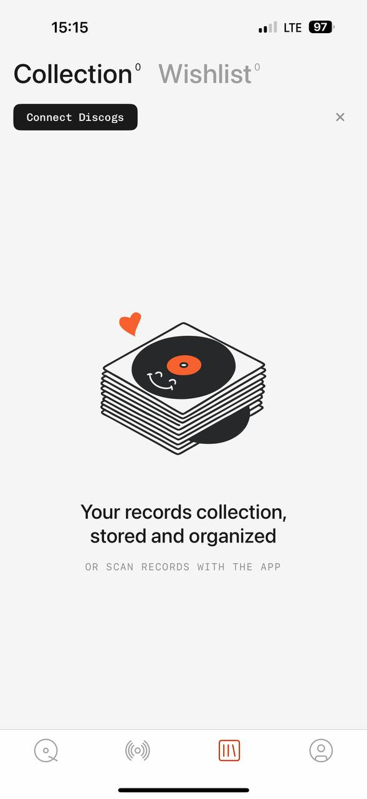

# MyPlastic reference 04 — collection empty state

Reference source: **MyPlastic / Plastic**
Status: **REFERENCE APPROVED FOR EMPTY STATE, CATEGORY TABS AND CONNECT CTA DIRECTION**
Scope: визуальный референс для empty state, category navigation, close action и contextual connect CTA bidplace
Platform: mobile
Source file: `myplastic-collection-empty-mobile-reference-01.png`
Image size: 589 × 1280 px
Implementation status: **Not implemented**

## Арт-директорский вывод

Экран показывает пустое состояние не как ошибку и не как белый экран: сначала видны две категории, затем конкретная кнопка подключения, а в центре — одна понятная иллюстрация, короткое объяснение и лёгкая secondary hint. Вся композиция остаётся спокойной и оставляет много воздуха.

Для bidplace это хороший ориентир для empty catalog, activity, saved items и seller drafts. Главный принцип — empty state должен объяснять, что делать дальше, но не превращаться в рекламный landing page.

## Разбор основных элементов

### 1. Категории и верхняя навигация

- `Collection` и `Wishlist` стоят рядом как крупные category tabs.
- Активная категория — тёмная; неактивная — светло-серая.
- Маленький superscript count аккуратно привязан к названию и не создаёт отдельный badge.
- Верхний уровень navigation сразу объясняет, какие два набора данных существуют.

Для bidplace подходит `ContentTabs` или `SegmentedControl` для близких сущностей: например, `Мои ставки` / `Мои покупки`, если product flow это подтверждает. Не превращать каждую вкладку в крупный заголовок, если на экране больше двух-трёх режимов.

### 2. Connect CTA и close icon

- Кнопка `Connect Discogs` — компактная чёрная pill/rounded control, а не огромный hero CTA.
- Она расположена сразу под категориями и связана с причиной empty state.
- Справа находится простой серый `X` для закрытия/скрытия connect prompt.
- Крестик не помещён в тяжёлый круг и не конкурирует с primary action.

Для bidplace:

- contextual CTA должен быть рядом с причиной отсутствия данных;
- `AppIcon`/`IconButton` с `X` или `XMark` должен иметь 44×44 px hit area, даже если визуальный знак тонкий и маленький;
- close action должен быть доступен с keyboard/Escape на web и иметь label «Закрыть»;
- не использовать `X` как случайную декоративную кнопку без ясного результата.

### 3. Empty illustration

- Иллюстрация находится в центре с большим свободным пространством вокруг.
- Она объясняет предметную область — записи, коллекция, сканирование — но не занимает весь экран.
- Иллюстрация имеет чёрно-белую основу и редкий orange accent.
- Под ней расположен короткий bold sans message в две строки.
- Ниже — мягкая mono hint uppercase, которая уточняет дополнительный путь.

Для bidplace можно использовать approved illustration или реальное изображение предмета только после подтверждения assets и прав. Не копировать пластинку, сердце или персонажную графику. Важно сохранить функцию: объяснить отсутствие данных и следующий шаг.

### 4. Типографика

- Category titles — крупный sans.
- Active state определяется тёмным цветом, inactive — muted gray.
- Empty-state headline — bold sans, короткий и человеческий.
- Secondary hint — маленький mono с увеличенным tracking.
- CTA — mono label, но не чрезмерно крупный.

Для bidplace это поддерживает разделение: user-facing explanation в sans, short CTA/status/metadata в mono. Заголовок должен быть на русском и говорить о конкретном состоянии: например, «Здесь появятся ваши ставки», а не копировать `Your records collection`.

### 5. Сетка, отступы и плотность

- Верхняя зона компактна и функциональна.
- Между CTA и empty illustration — много воздуха.
- Основная иллюстрация, headline и hint собраны в узкую центральную колонку.
- Нижний tab bar закреплён и отделён тонкой линией.
- Экран имеет низкую плотность, потому что данных нет.

Для bidplace empty state должен сохранять layout rhythm и safe area, но не занимать огромную высоту, если рядом нужно показать retry/error. На desktop эта композиция может стать centered panel без копирования mobile tab bar.

### 6. Нижняя навигация

- Четыре outline icons образуют постоянный mobile tab bar.
- Активный tab использует accent color; остальные — серые.
- Иконка collection визуально связана с текущей категорией.

Для bidplace это референс для `MobileTabBar`, но names и routes должны быть product-specific. Icon-only tabs обязательно имеют accessibility labels; selected state должен быть доступен не только по цвету.

## Что подходит bidplace

- крупные category tabs с quiet inactive state;
- компактная primary button, привязанная к причине empty state;
- аккуратный close icon без визуального контейнера;
- centered empty-state illustration + короткий headline;
- secondary mono hint под основным сообщением;
- низкая плотность там, где данных действительно нет;
- отдельный mobile tab bar с редким accent для active route.

## Что не подходит bidplace без адаптации

- копирование `Collection/Wishlist` и Discogs vocabulary;
- пластинки, heart illustration и сканирование как визуальные метафоры bidplace;
- декоративная иллюстрация без объяснения следующего действия;
- close icon без понятного dismiss behavior;
- огромный пустой экран, скрывающий retry/error;
- подсчёт как floating badge, если он не нужен продукту;
- использование orange для каждого active tab или CTA.

## Target mapping for bidplace

| MyPlastic pattern | bidplace adaptation |
| --- | --- |
| `Collection` / `Wishlist` tabs | Близкие buyer/seller data views после product decision |
| `Connect Discogs` | Реальный contextual next step: войти, создать профиль, добавить предмет, открыть фильтр |
| `X` close action | Закрыть prompt/sheet/banner с accessible label |
| Collection illustration | Approved empty-state illustration or meaningful item visual |
| Empty headline | Короткое русское объяснение отсутствия данных |
| Mono secondary hint | Неблокирующее уточнение или следующий возможный путь |
| Bottom tab bar | bidplace `MobileTabBar` with approved route semantics |

## Status

Референс утверждён для empty-state композиции, category navigation, contextual CTA, close icon и mobile tab bar direction. Он не утверждает иллюстрации, конкретные категории, product routes или финальную palette bidplace.
