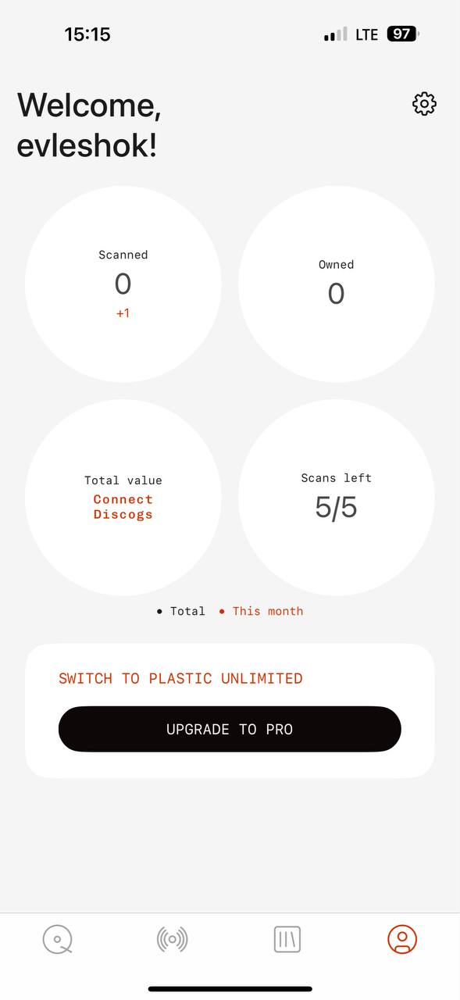

# MyPlastic reference 03 — dashboard and profile home

Reference source: **MyPlastic / Plastic**
Status: **REFERENCE APPROVED FOR PROFILE NAVIGATION AND CTA DIRECTION**
Scope: визуальный референс для profile/home dashboard, gear navigation, mobile tab bar и нижнего CTA bidplace
Platform: mobile
Source file: `myplastic-dashboard-mobile-reference-01.png`
Image size: 589 × 1280 px
Implementation status: **Not implemented**

## Арт-директорский вывод

Экран держится на простом персональном приветствии, четырёх крупных метриках, одном нижнем promotion/action block и постоянной нижней навигации. Визуальная система минимальна: светлый фон, белые circular surfaces, один red accent и почти незаметные separators.

Для bidplace полезны не сами метрики, а принцип: профильный экран должен давать короткий статус пользователя и один понятный следующий шаг. Круги нельзя переносить в bidplace только ради декоративного сходства — их нужно использовать лишь там, где числовые summary действительно помогают покупателю или продавцу.

## Разбор основных элементов

### 1. Header и gear navigation

- Большое приветствие занимает левую часть верхнего блока и сразу персонализирует экран.
- Gear icon находится отдельно справа на одной высоте с приветствием.
- Иконка тонкая, outline, без постоянной заливки или тяжёлого контейнера.
- Gear — самостоятельный navigation control в Settings, не декоративный элемент.

Для bidplace подходит `IconButton` с Lucide Settings и accessible label вроде «Настройки». Он должен иметь минимум 44×44 px touch target, visible focus и press state. Заголовок можно адаптировать под buyer/seller context, но не использовать фамильярный copy без продуктового решения.

### 2. Circular metrics

- Четыре одинаковых белых круга образуют спокойную 2×2 сетку.
- Внутри каждого круга: короткий mono label, крупное число или значение, иногда маленький accent delta.
- Круги имеют одинаковую геометрию и много внутреннего воздуха.
- Значение сильнее label; secondary delta не конкурирует с ним.

Для bidplace можно использовать этот принцип в seller/profile summary: например, количество опубликованных предметов, активных аукционов, завершённых продаж или черновиков — только если такие метрики реально поддержаны данными. Для buyer home не добавлять метрики вместо предметов и истории.

### 3. Нижняя кнопка и promotion block

- Promotion block — отдельная белая rounded surface с большим внутренним padding.
- Сначала идёт короткий accent mono message: `SWITCH TO PLASTIC UNLIMITED`.
- Затем широкая чёрная pill-кнопка `UPGRADE TO PRO`.
- CTA находится близко к нижней части основного контента, но выше tab bar.
- Кнопка визуально тяжёлая за счёт высоты, контраста и radius, а не из-за тени.

Для bidplace это хороший паттерн `BottomActionBar` или contextual CTA: короткое объяснение сверху, одна primary action снизу. Он может использоваться на Product detail для «Сделать ставку» или в seller flow для «Опубликовать предмет». Не копировать subscription upsell и не превращать каждый экран в рекламный блок.

### 4. Bottom tab bar

- Низ экрана занят постоянным tab bar с четырьмя простыми outline icons.
- Активная вкладка получает accent color; остальные остаются серыми.
- Подписи отсутствуют, поэтому иконки должны быть однозначными и иметь accessibility labels.
- Tab bar отделён тонкой верхней линией и учитывает safe area.

Для bidplace это референс для будущего `MobileTabBar`, но семантика должна быть своей: например, каталог, активность, продавать, профиль — только после утверждения route model. Не использовать icon-only navigation без screen-reader labels и tooltip/accessible name.

### 5. Типографика

- Приветствие — крупный обычный sans с сильным line-height и двумя строками.
- Labels и metric values — playful mono, более «инструментальный» и программистский.
- Accent copy и CTA label — mono uppercase.
- Основные цифры крупные и спокойные, без декоративной стилизации.

Это продолжает правило из MyPlastic Settings: mono подходит для коротких ролей, значений, CTA и metadata. В bidplace descriptions предмета, provenance, seller story и legal copy должны оставаться в читаемом sans.

### 6. Сетка, отступы и плотность

- Верхний блок имеет широкий mobile gutter.
- Между greeting и metrics — заметный gap.
- Metrics используют равную 2×2 grid с большими межкруговыми промежутками.
- Promotion block отделён большим вертикальным gap.
- Tab bar закреплён у нижнего края viewport.

Плотность низкая/средняя. Экран не пытается показать все данные пользователя — только summary и один action. Для bidplace это особенно полезно в seller dashboard, но не в каталоге, где visual discovery важнее dashboard metrics.

## Что подходит bidplace

- gear icon как очевидный переход в Settings;
- большие персональные заголовки без лишнего chrome;
- circular metric summary при наличии реальных данных;
- один широкоформатный primary CTA внизу смысловой области;
- короткая accent-подпись над CTA;
- собственный mobile tab bar с outline icons;
- safe-area aware нижняя навигация;
- минимализм без теней и лишних badges.

## Что не подходит bidplace без адаптации

- копирование метрик `Scanned`, `Owned`, `Scans Left`;
- subscription upsell как главный продуктовый мотив;
- четыре круга на каждом экране только ради визуального паттерна;
- icon-only tabs без accessibility labels;
- постоянный красный цвет для всех active states;
- promotion block, который конкурирует с предметом или аукционной CTA;
- dashboard-сетка вместо image-first Home.

## Target mapping for bidplace

| MyPlastic pattern | bidplace adaptation |
| --- | --- |
| Gear icon | `IconButton` → Settings |
| Welcome heading | Buyer/seller profile context with human, concise copy |
| Circular metric | Seller/profile summary only when backed by real data |
| Bottom promotion block | `BottomActionBar` for bid, publish, save, or next step |
| Black pill CTA | `PrimaryButton` with action-specific label |
| Red mono helper | Rare accent metadata/status, not decorative urgency |
| Four-icon tab bar | `MobileTabBar` with approved bidplace route semantics |

## Status

Референс утверждён для profile navigation, gear icon, contextual bottom CTA и mobile tab bar direction. Он не утверждает конкретные buyer/seller metrics, route structure, subscription model, palette или финальную копию bidplace.
