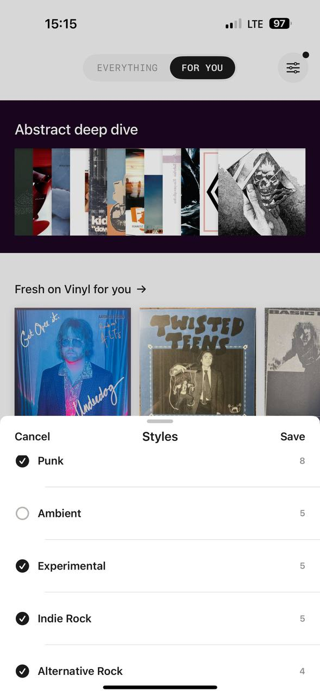

# MyPlastic reference 05 — discovery, switcher and filter sheet

Reference source: **MyPlastic / Plastic**
Status: **REFERENCE APPROVED FOR SWITCHER, FILTER SHEET AND IMAGE DISCOVERY DIRECTION**
Scope: визуальный референс для discovery header, segmented switcher, filter icon, image rows and native-style filter sheet bidplace
Platform: mobile
Source file: `myplastic-discovery-filter-mobile-reference-01.png`
Image size: 589 × 1280 px
Implementation status: **Not implemented**

## Арт-директорский вывод

Этот референс объединяет два слоя: discovery-экран с крупными изображениями и overlay bottom sheet для выбора фильтров. Они визуально связаны, но не конкурируют: верхний экран остаётся editorial, а sheet — функциональным и почти системным.

Главный reusable pattern — единая светлая полоска переключателя, внутри которой чёрное rounded окно плавно переезжает слева направо. Это ощущается нативно, понятно и не требует сложной графики. Для bidplace подходит как visual `SegmentedControl`, но его labels и поведение должны описывать auction/product states.

## Разбор основных элементов

### 1. Верхний switcher

- Светлая pill-полоска работает как общий контейнер.
- Активный segment — чёрное rounded окно поверх неё.
- Inactive label остаётся серым и не конкурирует.
- При переключении активное окно должно плавно перемещаться влево/вправо, а не исчезать и появляться.
- Контейнер компактный, центрирован и не занимает всю ширину экрана.

Для bidplace это подходит для двух-трёх взаимоисключающих режимов: например, `Все` / `Для вас`, `Активные` / `Завершённые`, если product semantics подтверждены. Не использовать для длинного списка фильтров и не создавать отдельный уникальный switcher на каждом экране.

Target motion: shared `LayoutTransition` или `SegmentedControl` preset, duration из общей motion scale, reduced-motion без translate. Состояние переключения не должно задерживать загрузку данных.

### 2. Filter icon

- Справа от switcher находится компактная круглая/rounded button.
- Outline filter/sliders icon легко читается на светлом фоне.
- Маленькая точка в углу показывает наличие активного фильтра.
- Иконка не сопровождается длинным label, но её смысл понятен из контекста.

Для bidplace использовать `IconButton` + `AppIcon`/Lucide Filter. Indicator dot не должен быть единственным способом сообщить состояние: добавлять selected/accessibility state и при необходимости текст `Фильтры: 2` внутри sheet или trigger label.

### 3. Editorial discovery content

- Под header расположен контрастный dark editorial section с коротким названием `Abstract deep dive`.
- Внутри — горизонтальная полоса изображений разного характера, которая создаёт visual discovery и ощущение подборки.
- Ниже на светлом фоне — секция `Fresh on Vinyl for you →` и крупные album tiles.
- Заголовок секции короткий, arrow является частью перехода.
- Изображения занимают больше пространства, чем metadata.

Для bidplace подходит разделение на curated editorial section и image-first catalog. Dark/plum section может быть редким тематическим surface для подборки, но не должен становиться постоянным фоном всего продукта. Album art заменяется реальными фотографиями предметов; image crop должен сохранять значимые детали и не скрывать состояние вещи.

### 4. Filter bottom sheet

- Sheet входит снизу поверх discovery content и имеет крупный верхний radius.
- Вверху есть короткий drag handle.
- Header симметричен: `Cancel` слева, title по центру, `Save` справа.
- Список фильтров — вертикальные rows с большой touch area и тонкими separators.
- Checkbox слева — чёрный filled selected или светлый outline unselected.
- Справа у каждой категории стоит маленькое число, выровненное по одной вертикали.
- Панель чёрно-белая, без лишних cards внутри sheet.

Для bidplace это прямой референс для `AppSheet` + `FilterChip`/checkbox group. `Cancel` закрывает без применения, `Save` применяет выбор и обновляет список. На desktop тот же public API должен открывать dialog/popover/side panel, а не копировать mobile sheet буквально.

### 5. Typography and counts

- Header labels и section titles — обычный sans.
- Switcher labels — compact mono/technical uppercase.
- Filter row labels — readable sans, крупнее metadata.
- Right-aligned counts — маленький muted mono, но с устойчивым табличным выравниванием.
- Checkbox label остаётся главным, count — вторичным.

Для bidplace right-aligned mono хорошо подходит для количества ставок, количества результатов, bids count и других коротких numeric values. Не использовать маленький текст для критического deadline или minimum next bid: auction-critical information должна оставаться доступной и заметной.

### 6. Spacing, image ratios and positioning

- Header controls находятся в одной компактной зоне с большим свободным полем вокруг.
- Dark editorial block отделён от светлого content section заметным horizontal boundary.
- Images в подборке идут крупными горизонтальными/квадратными блоками и допускают частичный следующий элемент, показывая горизонтальный scroll.
- Карточки album/image row расположены плотнее, чем текстовый контент, но между секциями остаётся большой vertical gap.
- Bottom sheet занимает существенную часть viewport, но оставляет сверху контекст текущего экрана.

Для bidplace:

- `AuctionCard` остаётся image-first; `CompactAuctionRow` используется в списках и sheet results;
- aspect ratio и crop должны быть tokenized, а не выбраны случайно в route;
- горизонтальный scroll допустим для curated collections, если управление доступно клавиатурой и screen reader;
- filter sheet не должен скрывать цену, deadline или состояние ставки после закрытия.

## Что подходит bidplace

- segmented switcher с плавным чёрным active indicator;
- filter icon в верхнем правом углу;
- маленькая indicator dot только как дополнительный signal;
- large image-first discovery blocks;
- contextual dark editorial section как редкая подборка;
- bottom sheet с Cancel / title / Save;
- checkbox rows с right-aligned counts;
- mono для коротких numeric values и control labels;
- сильная связь между размером изображения и приоритетом предмета.

## Что не подходит bidplace без адаптации

- копирование `Everything / For You` без определения product behavior;
- album covers и музыкальная taxonomy как доменная модель;
- постоянный dark purple фон или декоративный orange;
- скрытие аукционных данных за filter sheet;
- слишком маленькие counts для критического статуса;
- sheet, который закрывает primary CTA без восстановления состояния;
- сложная horizontal carousel без keyboard/accessibility behavior.

## Target mapping for bidplace

| MyPlastic pattern | bidplace adaptation |
| --- | --- |
| Everything / For You | Подтверждённые bidplace modes, например catalog/personal activity |
| Black sliding segment | `SegmentedControl` shared transition |
| Sliders icon | `IconButton` → `AppSheet` filters |
| Deep-dive image strip | Curated creator/item collection |
| Album tile row | `AuctionCard` image-first discovery |
| Styles sheet | Category/status/filter sheet |
| Checkbox + count | Multi-select filter with result count |
| Cancel / Save | Dismiss without apply / apply and refetch |

## Status

Референс утверждён для switcher motion, filter trigger, discovery image composition, bottom sheet и checkbox list direction. Он не утверждает конкретные bidplace categories, dark surfaces, palette, route semantics или album-like domain language.
