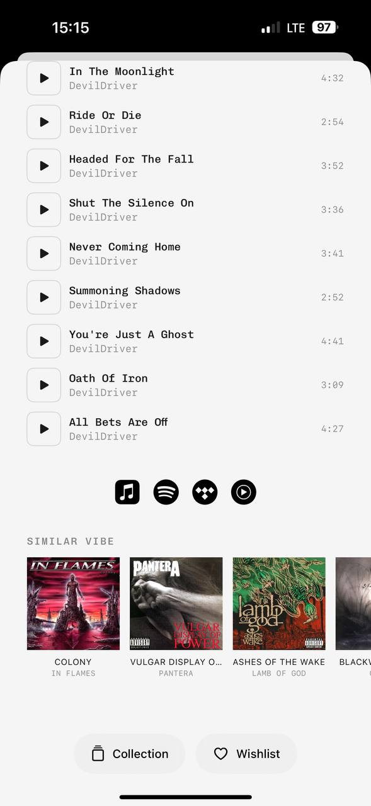

# MyPlastic reference 07 — product detail technical rows and similar items

Reference source: **MyPlastic / Plastic**
Status: **REFERENCE APPROVED FOR TECHNICAL ROWS, SIMILAR ITEMS AND BOTTOM SAVE ACTIONS**
Scope: визуальный референс для product detail, secondary technical metadata, related-item rail и contextual actions bidplace
Platform: mobile
Source file: `myplastic-product-detail-mobile-reference-01.png`
Image size: 589 × 1280 px
Implementation status: **Not implemented**

## Арт-директорский вывод

Экран показывает, как технически насыщенный detail section может оставаться лёгким: rows имеют одну понятную primary line, вторичную строку, маленькое значение справа и простой icon control слева. После основного контента появляется `SIMILAR VIBE` — горизонтальная related-items лента, а внизу остаются два спокойных rounded actions.

Для bidplace это полезная модель product detail: сначала предмет и его смысл, затем technical details и related items, а действия сохранения/наблюдения остаются доступными, но не конкурируют с основной auction CTA.

## Разбор основных элементов

### 1. Technical rows и play icons

- Каждая строка начинается с отдельной светлой квадратной кнопки с тонкой обводкой и play icon.
- Справа от icon — primary technical title в playful mono.
- Под title — muted secondary line, например имя исполнителя.
- Время справа выровнено по одной колонке и выполнено маленьким серым technical font.
- Rows имеют повторяемую высоту и тонкую вертикальную структуру без тяжёлых карточек.

Для bidplace это прямой паттерн для `DetailList`, `ActivityRow` или технических характеристик предмета:

- слева может быть icon типа материала, provenance, location или verification;
- основной label — название характеристики;
- под ним — пояснение/источник;
- справа — небольшое значение, дата, срок или количество;
- значения не должны визуально превосходить предмет, автора и auction CTA.

Play icon не переносится буквально, если в bidplace нет аудиоплеера. Использовать icon, который действительно запускает действие или открывает слой; декоративная play-кнопка запрещена.

### 2. Technical time typography

- Время `4:32`, `2:54` и аналогичные значения маленькое, серое и выровнено по правому краю.
- Оно заметно, но явно вторично по сравнению с title.
- Mono font делает значения похожими на технические данные и облегчает сканирование.

Для bidplace это хороший паттерн для:

- countdown/deadline в неосновном контексте;
- даты выставления предмета;
- количества ставок;
- времени последнего обновления;
- срока доставки или handoff detail, если он существует.

Но current bid, minimum next bid и критический remaining time на Product detail не должны становиться слишком маленькими или слишком серыми. Важность определяет contrast и size, а mono — только роль значения.

### 3. Service icons

- Под technical rows расположена горизонтальная группа чёрных круглых service icons.
- Иконки визуально одинакового размера и веса.
- Они показывают внешние сервисы/переходы, но не превращают экран в список ссылок.

Для bidplace использовать только реальные supported external links, provenance sources или share actions. Каждый icon имеет accessible label, а новый icon pack не добавляется ради декоративного сходства. Сторонние сервисы должны быть изолированы за `AppIcon`/link adapter.

### 4. Similar Vibe / related-items rail

- Label `SIMILAR VIBE` выполнен small uppercase mono и отделён от основной ленты.
- Под ним — горизонтальный ряд квадратных изображений.
- Под каждым изображением — title и muted author/creator metadata.
- Видна часть следующей карточки, поэтому понятно, что ряд можно листать.
- Related items не перегружены ценами, badges и длинными описаниями.

Для bidplace это сильный референс для Pinterest-like related products:

- `Похожие предметы`, `Из этой категории`, `От этого автора` или `Похожие по истории` — только после product decision;
- фото предмета главное;
- title и author вторичны;
- price/status могут появиться только если они нужны для выбора;
- горизонтальный rail должен иметь accessible scroll behavior и fallback для desktop.

Не называть блок `Similar Vibe`, если рекомендация основана на алгоритмике, категории или seller relation — label должен честно объяснять связь.

### 5. Bottom Collection / Wishlist actions

- Две большие светлые pill-кнопки находятся ниже related content.
- Они равны по визуальному весу, имеют простой outline icon и короткий label.
- Actions выглядят как reversible save/organize operations, не как primary purchase CTA.
- Большой radius и мягкий фон создают нативное ощущение iOS.

Для bidplace возможная адаптация — `Сохранить` / `Следить за аукционом` или `Добавить в подборку`, если такие функции реально входят в scope. Основное `Сделать ставку` должно оставаться отдельным, более приоритетным auction action и не смешиваться с save controls.

### 6. Black and white composition

- Основная surface светлая, black используется для primary text и icons.
- Серый reserved для secondary metadata и технических значений.
- Rounded controls и тонкие borders создают мягкость без большого количества цветов.
- Визуальная иерархия строится на размере, весе, отступе и alignment, а не на десятках badges.

Для bidplace это совпадает с минималистичным editorial direction. Accent должен появляться только там, где он сообщает состояние или важное действие.

## Что подходит bidplace

- повторяемые technical rows с primary/secondary text;
- небольшой серый mono для даты, таймера и вторичных значений;
- иконка слева как действие только при реальной интерактивности;
- related-items rail в стиле Pinterest;
- partial next card для mobile discovery;
- две мягкие rounded secondary actions внизу detail;
- почти чёрно-белая иерархия;
- отдельная primary auction CTA поверх save/related actions.

## Что не подходит bidplace без адаптации

- прямое копирование playlist и music-service icons;
- маленький серый шрифт для обязательной ставки или критического дедлайна;
- related row без честного объяснения связи с предметом;
- внешние service icons без реального перехода;
- Collection/Wishlist actions до появления соответствующего product scope;
- одинаковый detail layout для всех domain types без проверки данных.

## Target mapping for bidplace

| MyPlastic pattern | bidplace adaptation |
| --- | --- |
| Play button row | Technical detail row with meaningful action/icon |
| Track title | Item attribute or provenance fact |
| Artist line | Author, seller or source |
| Duration | Deadline, date, count or technical value |
| Similar Vibe | Honest related-items section |
| Album cover | Item photo / `AuctionCard` thumbnail |
| Collection | Save/follow/curated list only if supported |
| Wishlist | Watch auction or save item only if supported |

## Status

Референс утверждён для technical metadata hierarchy, compact detail rows, related-item rail и secondary bottom actions. Он не утверждает audio behavior, playlist semantics, save/watch product scope или финальную карточку Product detail bidplace.
