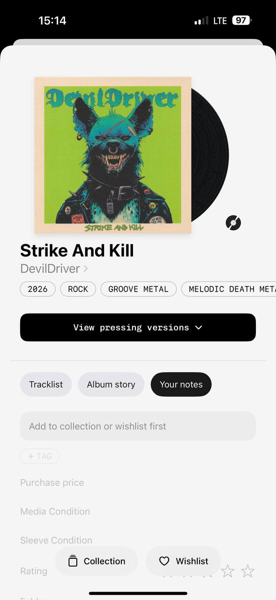
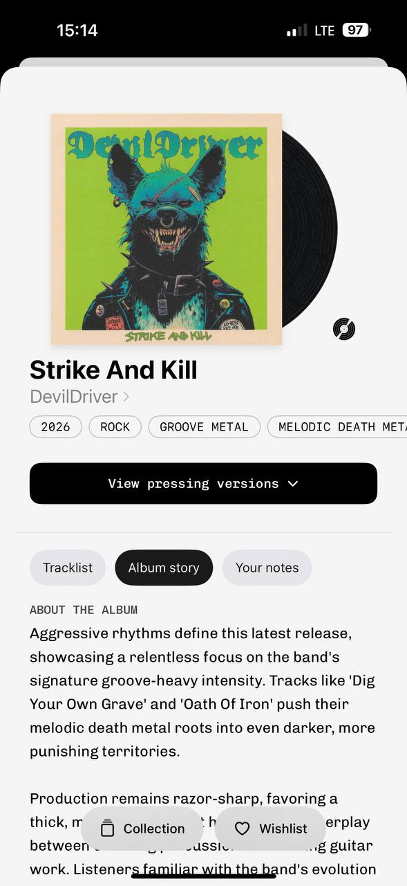

# PRIMARY MyPlastic reference — bidplace product detail

Reference source: **MyPlastic / Plastic**

Status: **PRIMARY VISUAL REFERENCE FOR BIDPLACE PRODUCT DETAIL**
Scope: будущая страница товара bidplace: hero, title, author, tags, primary action, progressive disclosure tabs, history/story and secondary details
Platform: mobile
Source files: `myplastic-product-page-notes-mobile-reference-01.png`, `myplastic-product-page-story-mobile-reference-02.png`
Image size: 589 × 1280 px each
Implementation status: **Not implemented**

## References

### Notes state



### Story state



These two images are the defining visual reference for future bidplace Product detail work. They are not a production screen and do not replace bidplace product rules, auction behavior, privacy requirements, or accessibility acceptance.

## Core direction

The page is quiet, tactile and information-led. A single object image dominates the hero; a partially visible black disc/mark behind it adds volume and visual character without another card or control. The title is large and black, the author is smaller and gray, and the arrow creates a simple transition into the author profile. Tags are compact and outlined. A wide black button creates the only dominant action.

The rest of the page is divided into a small number of pills/tabs. Only one information layer is open at a time, so the user receives the right amount of detail without a long undifferentiated wall of text.

## Page anatomy

```text
Product hero
  main object image
  offset black disc/mark or related visual volume
  Product title
  Author / seller → profile
  compact metadata tags
  Primary black CTA

Information switcher
  О предмете
  История создания
  Происхождение / activity / another approved layer

Selected content
  concise facts or long-form story
  auction-critical data remains visible when relevant

Related items / similar products
Sticky or contextual action only where needed
```

The exact third tab is not copied from the reference automatically. For bidplace it should be selected from product requirements; the target direction already identifies `О предмете`, `История создания`, and `Происхождение` as likely layers.

## What is defining for bidplace

### 1. Object plus offset visual volume

The object image is not a flat thumbnail. The offset disc/mark partially emerges from behind it, creating depth and visual character with only black, white, and the colors already present in the object photo. This is the preferred way to add volume: composition and overlap, not shadows, gradients, or extra decorative cards.

For bidplace, the secondary shape could be a controlled provenance/edition mark, material detail, or neutral offset surface. It must never hide the item, imply unsupported authenticity, or become a decorative brand symbol without approval. Use the pattern primarily on Product detail and selected author/product cards, not everywhere.

### 2. Title and author hierarchy

- Product title is large, dark, and immediately readable.
- Author is directly below in a quieter gray style.
- Arrow sits with the author and makes the whole line a profile transition.
- No large seller panel is needed above the fold.

Bidplace should use the same hierarchy: item first, author/provenance second, full profile behind a simple link. Public seller data must remain limited to approved fields; private handoff data never belongs here.

### 3. Compact tags

Outlined pills expose short, scannable values: year, category, genre and subcategory. They support context without turning the hero into a metadata table.

Adaptation: use tags for category, material, year, edition, location or verified provenance only when those values exist in the product contract. Do not put price, deadline, or a critical auction state into a low-contrast decorative tag.

#### Mandatory tag rules for bidplace

- Tags are short anchors, not miniature paragraphs: one concept per tag.
- Use a light surface or transparent background with a thin neutral outline and a calm pill radius.
- Use the same mono/technical label role as the reference; keep the text readable in Russian and avoid unnecessary uppercase.
- Typical roles are `НОВИНКА`, year of creation, category, material, edition, city/origin or verified provenance.
- `НОВИНКА` and other semantic labels may use the rare accent color; ordinary category/year tags stay near monochrome.
- Tags may be horizontally scrollable on mobile, with the next tag partially visible, but the first important tags must be visible without interaction.
- Tags can become filter anchors when the value maps to a real catalog/filter dimension; tapping must not imply filtering if no such behavior exists.
- Do not use tags for current bid, minimum next bid, deadline, errors, private seller data or arbitrary marketing claims.
- Keep the set small enough that the title, author, image and primary CTA remain visually dominant.
- Status must not rely on color alone: semantic labels also need text, accessible state and a clear source of truth.

### 4. Primary black CTA

The wide black rounded button is the visual anchor under the hero. It has a short mono label, enough height for touch, and a small chevron only when it opens a next layer. It is visually stronger than tags and tabs.

For bidplace the action becomes `Сделать ставку`, `Открыть аукцион`, `Добавить предмет` or another real next step. The CTA must show loading, disabled, error and success/rejected states. It must not be used as a generic subscription or decorative button.

### 5. Progressive disclosure tabs

The switcher is a single light rounded strip with one black selected pill. Unselected options are light gray with dark text; the selected option is black with white text. The binary contrast is calm, legible and unmistakable.

The selected layer changes content below without changing the hero. This is the key information architecture to preserve:

- first layer: essential product facts;
- second layer: creation story/history;
- third layer: provenance, condition or another approved detail layer.

The tab control should animate the selected black window with a shared short transition. Reduced motion removes translation while preserving the selected state.

### 6. Two-color visual language

The reference uses mostly black, white, light gray, and colors naturally present in the object image. Black marks selected state and primary action; white/gray creates surfaces and unselected state. This makes the page feel paper-like, calm and modern.

For bidplace, keep the UI base near monochrome and let the object photo provide most of the color. Accent can be reserved for a meaningful auction status or editorial announcement, but it should not compete with the black CTA or selected tab.

## State-specific reading

### Notes state

The notes state shows a muted input-like panel and secondary details below the tabs. It communicates that some information is unavailable until the item is saved/collected, without making the state feel like an error.

Bidplace adaptation: use a clear empty/locked explanation only where a real capability gate exists. Do not copy `Add to collection or wishlist first` unless save/follow behavior is actually implemented.

### Story state

The story state replaces the compact details with a readable long-form narrative. The small mono `ABOUT THE ALBUM` label introduces the content; the body text uses a normal sans and comfortable line height.

Bidplace adaptation: `История создания` should use normal readable typography for paragraphs. Mono is reserved for the short section label, not the story itself. Long Russian copy, loading, error and truncated/expanded behavior require QA.

## What fits bidplace

- Product-first hero with controlled overlap/offset visual;
- large black title and gray author link;
- author profile transition via inline arrow;
- compact outlined metadata pills;
- one wide black primary CTA;
- three-layer progressive disclosure for item, story and provenance;
- selected black / unselected gray tab contrast;
- technical/secondary details muted but readable;
- item photos as the main source of color;
- related products below the primary content.

## What does not fit without adaptation

- music/album vocabulary, record disc and label as literal bidplace domain UI;
- hiding current bid, minimum next bid or deadline inside secondary tabs;
- gray low-contrast treatment for auction-critical values;
- adding an offset mark that implies verification or limited edition without evidence;
- putting too many tags in the hero;
- using three tabs for arbitrary content without a clear user question;
- copying the exact notes/collection gate before the corresponding feature exists.

## Target mapping for bidplace

| Reference pattern | bidplace target |
| --- | --- |
| Album cover + offset record | Item hero + controlled provenance/edition offset visual |
| `Strike And Kill` | Product title |
| `DevilDriver →` | Public author/seller profile link |
| Year/genre pills | Year/category/material/edition tags |
| `View pressing versions` | `Смотреть варианты/условия` only if supported; otherwise primary auction CTA |
| Tracklist | `О предмете` / structured facts |
| Album story | `История создания` |
| Notes | `Происхождение` or user-specific notes only if scope exists |
| Year/category pills | Product anchors and filter dimensions |
| `NEW`/editorial label | Rare data-backed `НОВИНКА` or announcement |
| Collection / Wishlist | Save/follow actions only after product decision |

## Acceptance gates before implementation

- [ ] Owner confirms the hero overlap treatment for bidplace assets.
- [ ] Product contract defines the three information layers and their required data.
- [ ] Auction-critical price, minimum bid, deadline and status remain visible in every relevant state.
- [ ] Author link uses public data only.
- [ ] Tab motion has a reduced-motion behavior.
- [ ] Real object images pass crop, aspect-ratio and accessibility review.
- [ ] Mobile keyboard, safe area, loading, empty, error, offline and long-story states are defined.
- [ ] Desktop adaptation is documented before implementation.

## Status

This folder is the **primary visual reference** for the future bidplace Product detail page. It establishes the intended composition and information pacing, not final production tokens or business behavior. Any future Product detail design should start here and then reconcile the result with `00-project-decisions.md`, product contract, accessibility rules and current implementation constraints.
