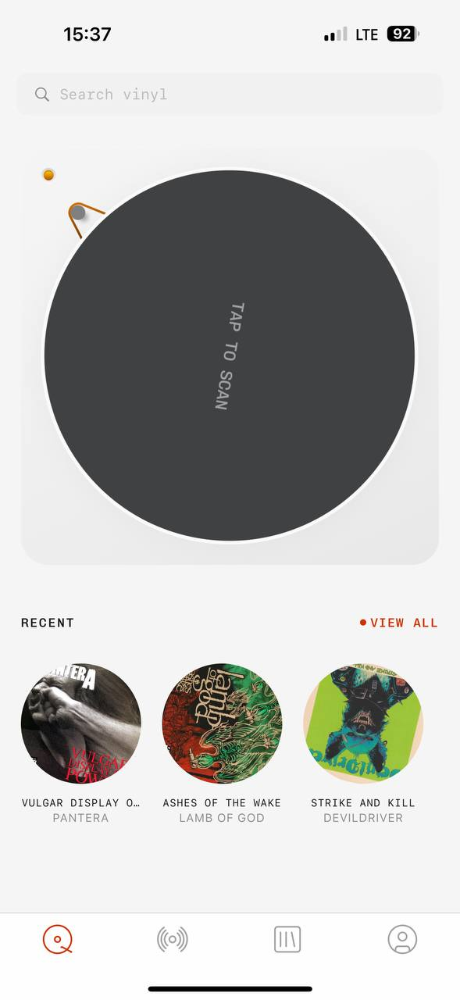

# MyPlastic reference 09 — search, scan action and recent items

Reference source: **MyPlastic / Plastic**
Status: **REFERENCE APPROVED FOR SEARCH, RECENT CONTENT AND QUIET TECHNICAL UI DIRECTION**
Scope: визуальный референс для search entry, dominant discovery action, recent items, `View all` navigation и programmer-style mono bidplace
Platform: mobile
Source file: `myplastic-search-scan-mobile-reference-01.png`
Image size: 589 × 1280 px
Implementation status: **Not implemented**

## Арт-директорский вывод

Экран выглядит как инструмент, а не как перегруженный маркетплейс. Вверху — спокойный search field с серым mono placeholder. В центре — одна большая action surface для scan/discovery. Ниже — тихий label `RECENT`, справа — `• VIEW ALL` с редким orange accent, а под ним три круглых recent items.

Это хороший пример programmer-style interface: технический, playful и немного экспериментальный, но очень ясный по приоритетам. Для bidplace стоит взять иерархию и ритм, а не буквальный scan mechanism.

## Разбор основных элементов

### 1. Search field

- Search field почти на всю ширину, но остаётся лёгким и незаметным.
- Search icon серый, placeholder серый mono, active input должен стать темнее.
- Field не обведён тяжёлой рамкой и не конкурирует с центральным action.
- Текст `Search vinyl` короткий и технический.

Для bidplace подходит `AppInput`/search adapter с placeholder вроде `Найти предмет или автора`. Mono можно использовать в коротком placeholder и metadata, но введённый русский текст должен оставаться удобным для чтения. Search error, empty result и clear action обязательны.

### 2. Dominant action surface

- Огромный dark circular surface занимает центральное место.
- Надпись `TAP TO SCAN` повернута и остаётся минимальной.
- Маленький orange/gray механический элемент сбоку добавляет характер и объясняет действие.
- Большая форма создаёт ощущение физического объекта и делает interaction obvious.

Для bidplace можно адаптировать сам принцип одной большой discovery action: например, `Открыть подборку`, `Показать предметы рядом` или будущий visual search, если он реально входит в scope. Не копировать диск/scan metaphor без поддержанного сценария. Большой interaction surface должен иметь ясный label, pressed state, loading и error.

### 3. `RECENT` и `• VIEW ALL`

- `RECENT` — маленький uppercase mono label слева, почти не привлекает внимание.
- `• VIEW ALL` справа сочетает маленькую orange dot и orange mono link.
- Dot работает как визуальный marker, а текст сохраняет понятность.
- Link расположен в одной baseline row с section label.

Для bidplace это подходит для `НЕДАВНИЕ`, `• СМОТРЕТЬ ВСЕ`, `• ОТКРЫТЬ ВСЕ` или `• ВСЕ СТАВКИ`. Orange dot следует использовать только как дополнительный signal нового/активного состояния, а не как единственный notification. Link должен иметь полноценный hit area и accessible name.

### 4. Recent item circles

- Recent items показаны круглыми crops, а не квадратными карточками.
- Под image — короткий uppercase/mono title, ниже — muted author.
- Текст truncated, но hierarchy сохраняется.
- Три элемента достаточно, чтобы дать ощущение истории без перегруза.

Для bidplace круглый crop подходит для recent authors, saved searches, watched items или compact recent activity. Для discovery предмета, где важны форма и состояние, использовать прямоугольный `AuctionCard`; круг не должен скрывать важные части фото.

### 5. Typography and color

- UI почти monochrome: pale surface, dark action, gray supporting text.
- Mono используется в placeholder, labels, `VIEW ALL` и коротком image metadata.
- Orange появляется только в dot и active navigation icon.
- Большой dark element создаёт контраст, но не использует градиент или тень.

Для bidplace это продолжает общую Modern UI direction: black/white first, image supplies color, orange only for meaningful accent. Programmer-style mono не должен вытеснять human sans из stories, descriptions и product titles.

### 6. Positioning and density

- Search остаётся в верхней зоне.
- Большой action имеет отдельное пространство и не смешан со списком.
- Recent block имеет большое дыхание между heading и images.
- Bottom navigation остаётся лёгкой и фиксированной.
- На экране мало элементов, но каждый имеет отдельную роль.

Для bidplace такой ритм можно использовать на входе в каталог, profile/activity home или seller dashboard. Не превращать Product detail в dashboard с большой декоративной кнопкой, если основное действие — ставка.

## Что подходит bidplace

- тихий search field с gray mono placeholder;
- крупная одна discovery action, когда есть реальный сценарий;
- `RECENT` как ненавязчивый secondary section;
- `• VIEW ALL` с редким orange marker;
- circular recent authors/items в компактных контекстах;
- programmer-style mono для коротких технических labels;
- monochrome surface с одним акцентным цветом;
- ясное разделение primary action и recent content.

## Что не подходит bidplace без адаптации

- literal `Tap to scan` или виниловый диск без поддержанной функции;
- orange dot без доступного текстового состояния;
- круглый crop на карточке, где нужно увидеть весь предмет;
- слишком бледный placeholder, который теряет contrast;
- recent list без понятного источника данных;
- большая декоративная action surface рядом с auction CTA;
- использование developer-like mono в длинных русских текстах.

## Target mapping for bidplace

| MyPlastic pattern | bidplace adaptation |
| --- | --- |
| `Search vinyl` | Search предметов и авторов |
| `Tap to scan` | Real supported discovery action, not a placeholder |
| `RECENT` | Недавние просмотры, ставки, авторы или поиски |
| `• VIEW ALL` | Переход ко всему списку recent/selected content |
| Circular album image | Recent creator/item thumbnail where crop is safe |
| Orange dot | New/active filter or recent-state indicator with text |
| Technical mono labels | CTA, metadata, dates, counts, filter labels |
| Dark central surface | One contextual action surface with a clear purpose |

## Status

Референс утверждён для search entry, recent-content hierarchy, `View all` marker, restrained orange dot и programmer-style technical typography. Он не утверждает scan feature, circular treatment для всех товаров или конкретную bidplace navigation model.
