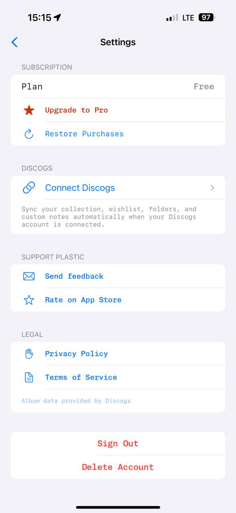

# MyPlastic reference 02 — Settings

Reference source: **MyPlastic / Plastic**
Status: **REFERENCE APPROVED FOR SELECTIVE TYPOGRAPHY AND SETTINGS PATTERNS**
Scope: визуальный референс для settings, grouped actions и точечного playful mono в bidplace
Platform: mobile
Source file: `myplastic-settings-mobile-reference-01.png`
Image size: 589 × 1280 px
Implementation status: **Not implemented**

Этот экран особенно полезен не как готовая палитра, а как пример сочетания обычного sans-заголовка с более игрушечным, программистским mono-шрифтом в действиях и пояснениях. Визуальный характер напоминает интерфейсы инструментов для создателей и разработчиков: немного технический, живой и не стерильный.

## Арт-директорский вывод

Основная идея — сложные настройки превращаются в несколько коротких, легко сканируемых групп. Каждая группа имеет label, белую rounded surface и простые rows с divider. Действия различаются цветом по смыслу: нейтральные ссылки — синие, upgrade — красный, destructive actions — красные в отдельном блоке.

Для bidplace подходит именно структура и типографическая иерархия. Цвета и содержание должны быть адаптированы: bidplace не должен выглядеть как subscription utility app или экран настроек чужого сервиса.

## Разбор основных элементов

### 1. Композиция и группировка

- Наверху — back button и центрированный title `Settings`.
- Секции разделены uppercase/small sans labels: Subscription, Discogs, Support Plastic, Legal.
- Каждая секция помещена в отдельную светлую rounded group surface.
- Внутри группы rows разделены тонкими линиями, но внешняя карточка не перегружена рамками.
- Отдельный нижний блок с `Sign Out` и `Delete Account` визуально отделяет destructive actions от обычных настроек.
- Внутри интеграционного блока есть title/action row и explanatory description под divider.

Для bidplace это хороший паттерн `SettingsGroup → SettingsRow`. Не превращать каждый экран в набор карточек: grouped surface нужна для настроек, меню профиля и компактных административных действий, но не для основной discovery-ленты.

### 2. Типографика

- Навигационный и секционные заголовки используют простой sans serif.
- Основные actions (`Upgrade to Pro`, `Restore Purchases`, `Connect Discogs`, `Send feedback`, `Privacy Policy`) используют моноширинный serif/slab-like шрифт.
- Mono здесь не выглядит сухим: крупный кегль, спокойный line-height и цвет делают его дружелюбным и «программистским».
- Explanatory copy — тоже mono, но меньшего размера и серого цвета.
- Footer note — очень маленький, бледный mono-текст.
- Основные значения (`Plan`, `Free`) поддерживают ту же техническую интонацию.

Для bidplace:

- использовать этот playful mono в коротких action labels, фильтрах, статусах, цене/таймере и технических metadata;
- оставлять обычный sans для длинных историй, seller descriptions, onboarding и legal copy;
- не делать весь интерфейс mono: потеряется человеческая редакционная подача и ухудшится чтение длинных текстов;
- финальный mono-шрифт и поддержка кириллицы должны быть проверены отдельно.

### 3. Цветовая семантика

- Синий — активные, безопасные, навигационные и интеграционные действия.
- Красный — upgrade emphasis и destructive actions; внизу он используется как явное предупреждение.
- Серый — secondary description и footer metadata.
- Фон холодный, почти лавандово-серый; surfaces белые.

Для bidplace это пример semantic color roles, а не готовые target tokens. Не переносить синий и красный напрямую. В target Modern UI уже предусмотрена почти монохромная база; accent должен быть редким и объяснимым, а destructive actions — отделены и дополнены текстом.

### 4. Сетка и отступы

- Большой горизонтальный gutter создаёт спокойную узкую колонку.
- Между section label и group surface — небольшой gap.
- Между группами — заметный vertical rhythm.
- Внутри row горизонтальные padding и достаточная высота touch target.
- Description занимает собственную область и не смешивается с action row.
- Нижняя destructive group имеет дополнительный воздух перед собой.

Для bidplace использовать общую spacing scale Modern UI, а не новые значения специально под MyPlastic. На mobile нужно проверить safe area, keyboard и доступность длинных русских label.

### 5. Форма элементов

- Group surface — крупный, но не чрезмерный radius; без тяжёлой тени.
- Row — плоская surface с divider.
- Иконки — тонкие outline icons одного набора, слева от action.
- Chevron показывает переход в дочерний экран.
- Back icon — отдельный accent-colored control без постоянного круглого контейнера.
- Destructive rows — центрированные крупные текстовые actions в отдельной group surface.

Для bidplace это поддерживает `SettingsRow`, `SettingsGroup`, `AppIcon`, `BackButton` и `AppDialog` для подтверждения удаления/выхода. Нельзя делать destructive action только цветом: текст и confirmation должны быть ясными.

### 6. Визуальная плотность

Плотность средняя: на одном экране много настроек, но они распределены по группам и читаются как последовательность коротких решений. Белые поверхности создают ритм, а серый фон не конкурирует с контентом.

Этот уровень плотности подходит Settings, Activity filters и Admin controls. Он не подходит для Home: в каталоге предмет, автор, фото, история и auction state должны иметь приоритет над группировкой.

### 7. Навигация

Навигация минимальна: back button, title, rows с chevron и отдельные действия. Нет sidebar, tabs или bottom navigation внутри settings.

Для bidplace:

- mobile settings открывается из profile gear button;
- desktop может использовать sidebar только на уровне shell, но содержимое settings остаётся grouped list;
- row с переходом должен быть полноценным accessible control;
- destructive actions открывают `AppDialog` или `AppSheet` с подтверждением;
- интеграционные действия должны отражать реальные возможности продукта, а не копировать Discogs semantics.

## Что подходит bidplace

- playful mono в коротких действиях и metadata;
- sans для section headings и длинного текста;
- grouped settings surfaces;
- простые outline icons;
- semantic blue/red roles как идея, не как готовые значения;
- отдельная destructive group;
- много воздуха и тонкие dividers;
- row description, когда она объясняет действие.

## Что не подходит bidplace без адаптации

- копирование subscription flow и `Upgrade to Pro`;
- Discogs, App Store и чужие интеграционные названия;
- использование mono во всех текстах приложения;
- холодный lavender background как обязательный брендовый фон;
- красные actions без подтверждения и объяснения последствий;
- декоративные иконки, не связанные с действием;
- одинаковые grouped cards на Home и Product detail.

## Target mapping for bidplace

| MyPlastic pattern | bidplace adaptation |
| --- | --- |
| Settings group | Профиль, настройки аккаунта, seller preferences |
| Connect Discogs row | Подключение реального bidplace-supported сервиса или handoff setting |
| Mono action label | Короткий CTA, filter, status, price, deadline, technical metadata |
| Blue link action | Нейтральное действие или navigation link после проверки target palette |
| Red destructive group | Выйти, удалить аккаунт, отменить действие — только с подтверждением |
| Explanatory mono text | Короткая helper/metadata строка, не длинная история предмета |
| Chevron row | Переход в detail/settings sub-screen |

## Status

Референс утверждён как источник selective typography и settings patterns. Он не утверждает исходный mono font Plastic, palette, subscription model или содержимое bidplace settings. Консолидированные target-правила находятся в [`../../../../DESIGN.md`](../../../../DESIGN.md).
