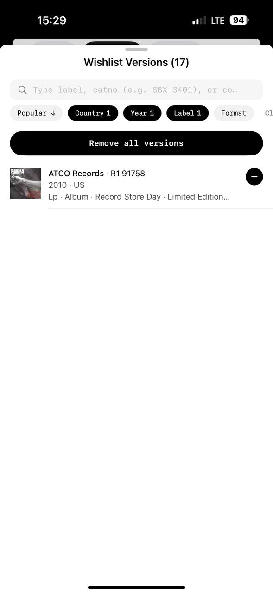

# MyPlastic reference 10 — sorting, selected filters and compact rows

Reference source: **MyPlastic / Plastic**

Status: **REFERENCE APPROVED FOR SORTING, FILTER CHIPS AND CONSISTENT LIST AFFORDANCES**
Scope: visual direction for bidplace search/sort/filter controls, compact rows, repeated arrows/icons and destructive actions
Platform: mobile
Source file: `myplastic-versions-filter-mobile-reference-01.png`
Image size: 589 × 1280 px
Implementation status: **Not implemented**

## Art direction

The screen feels like a tool for a creative person: functional, technical, and not corporate. Its consistency comes from repeating the same small vocabulary—soft search field, mono labels, pill chips, black selected states, thin separators, and the same rounded black action shape. Nothing has to shout because the system repeats itself calmly.

This is the right lesson for bidplace: the same arrows, chips, icon weight, row rhythm, and primary-button geometry must mean the same thing across catalog, product, seller, activity, and settings surfaces.

## Main elements

### 1. Sorting and filter chips

- `Popular ↓` is a quiet sorting control: light pill, mono label, one downward arrow.
- Selected dimensions (`Country 1`, `Year 1`, `Label 1`) are black pills with white mono text and an included selected count.
- Unselected dimensions (`Format`) stay light and visually secondary.
- The row can horizontally scroll; only the currently useful filters receive the strong contrast.

For bidplace, use the same component for catalog filters: `Все`, `Категория`, `Материал`, `Год`, `Заканчивается`, or other product-backed dimensions. A selected count is useful only where multi-selection actually exists. Sorting arrow direction must correspond to a real order and be announced to assistive technology.

### 2. Destructive bulk action

- `Remove all versions` has the same broad black rounded form as a primary button.
- Its wording is explicit and global: it applies to all displayed versions, not one row.
- The visual strength signals consequence, while the text states exactly what happens.

For bidplace, destructive actions must remain separate from ordinary CTAs: archive draft, remove saved item, cancel seller action, or delete account only where supported. A black button alone is not enough—use a confirmation dialog/sheet, clear consequence text, loading/error feedback, and a recoverable path where possible. Do not use a bulk destructive action beside auction bidding controls.

### 3. Compact list row

- A small image starts the row without becoming a full card.
- The first line is the primary title/version name.
- The second line is subdued technical context (year · country).
- The third line carries extended metadata and truncates cleanly.
- A divider separates rows instead of a shadow or full rounded card.
- A circular minus icon on the right is a row-specific destructive affordance.

For bidplace this maps to `CompactAuctionRow` and selected-item lists: thumbnail, title, author or provenance detail, then a secondary price/status/deadline line. Critical auction state must remain more legible than the reference’s tertiary metadata.

### 4. Repeated arrows and icons

- The sort arrow, chevrons, back arrow, and other directional marks share a thin, restrained language.
- Each icon has one job and is repeated rather than reinvented by screen.
- The row delete icon is visually different from navigation, so accidental actions are less likely.

Bidplace rule: use `AppIcon` and `IconButton` consistently. Inline `→` means navigation to a fuller view; chevrons indicate a nested route or expanded layer; a minus/trash icon is destructive only. Do not swap symbols arbitrarily between screens.

### 5. Typography, tags and information hierarchy

- Screen title is simple sans and centered.
- Search placeholder, sort, chips, and destructive button use technical/playful mono.
- Primary row title is dark and larger.
- Secondary information is gray and quieter.
- Chips act as tags and filter anchors without competing with the list content.

This is compatible with the bidplace product-page tag rules: keep tags short, connected to real data/filter dimensions, and limited in number. The title, object image, author, price, and deadline still determine hierarchy.

## What fits bidplace

- Quiet search followed by a horizontal sort/filter row;
- Black selected pills with white text and optional real count;
- Light unselected pills;
- One shared arrow/icon vocabulary across screens;
- Technical mono for controls and metadata;
- Compact rows with a thumbnail and clear three-level hierarchy;
- Separators instead of heavy card chrome;
- Explicit destructive action pattern with confirmation;
- Consistent rounded black primary action form.

## What requires adaptation

- `Remove all versions` is a music-collection action, not a bidplace auction action;
- A minus icon must never remove a bid, product, or saved data without confirmation;
- Country/year/label chips require real bidplace filter data;
- No destructive action should look identical to `Сделать ставку` in context without clear text and confirmation;
- Dense technical metadata must not hide provenance, seller, current bid, or deadline;
- Horizontal chip rows require keyboard, screen-reader, and narrow-viewport behavior.

## Target mapping for bidplace

| MyPlastic pattern | bidplace adaptation |
| --- | --- |
| `Popular ↓` | Catalog sort order |
| Selected chip `Year 1` | Active filter with actual selected count |
| Unselected `Format` pill | Available filter dimension |
| `Remove all versions` | Confirmed bulk remove/archive only where supported |
| Version row | Compact auction/activity/saved-item row |
| Minus icon | Confirmed remove from saved list/draft only |
| Repeated arrows | Shared navigation affordance through `AppIcon` |

## Status

This reference establishes visual consistency rules for filters, sorting, compact rows, arrows, and destructive controls. It does not add bulk actions or deletion capabilities to the bidplace product scope.
