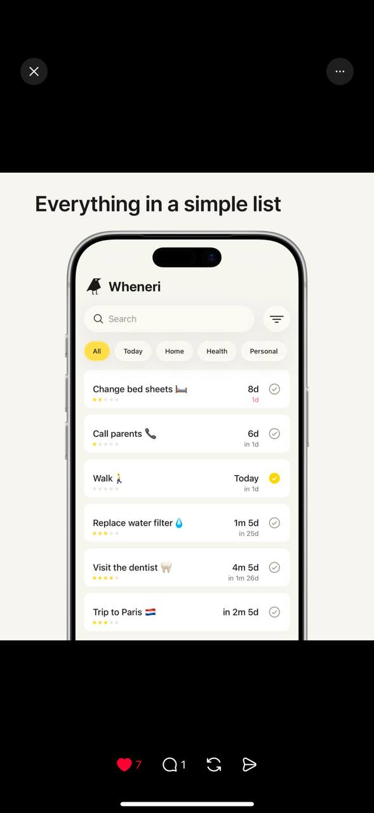

# Tracker reference 01 — filters and simple list

Reference source: **Tracker**
Status: **REFERENCE APPROVED FOR FILTER AND LIST DIRECTION**
Scope: визуальный референс для фильтров, поиска и компактного списка аукционов bidplace
Platform: mobile
Source file: `tracker-list-mobile-reference-01.png`
Image size: 589 × 1280 px
Implementation status: **Not implemented**

Это отдельный сервис-трекер. Он не является визуальным источником бренда bidplace целиком. Из него берём отдельные reusable patterns: поиск, filter icon, chips, selected state, checkbox и компактную пару «главное значение + вторичная временная подпись».

## Арт-директорский вывод

Референс строится вокруг простой задачи: быстро найти и отметить элемент в списке. Все controls имеют одинаковую мягкую округлую форму, светлую поверхность и минимальный контраст. Единственный активный цвет — тёплый жёлтый — помогает увидеть выбранный фильтр и завершённый элемент, не превращая экран в набор цветных badges.

Главный принцип для bidplace: взять эту ясность и контроль плотности, но заменить tracker-семантику на аукционную: предмет, автор, текущая ставка, статус и дедлайн.

## Разбор основных элементов

### 1. Композиция

- Внешняя композиция использует большой заголовок над экраном телефона и чёрный фон вокруг презентационного mockup; чёрный фон не является частью рабочего UI.
- Внутри приложения — один заголовок, затем search row, затем горизонтальные filter chips, затем вертикальный список.
- Фильтр вынесен в отдельную круглую кнопку справа от поиска и не перегружает search field.
- Список состоит из повторяющихся светлых rounded rows с ясным разделением левой и правой информации.
- Внутри строки: название слева, таймер/срок справа, вторичная подпись под ним и checkbox в крайнем правом положении.

Для bidplace подходит композиция «search/filter → filter chips → compact auction rows». Не нужно копировать рекламный mockup телефона или верхний чёрный фон в приложение.

### 2. Типографика

- Заголовок — крупный bold sans, короткий и легко сканируемый.
- Placeholder поиска — серый, заметно мягче основного текста; он не конкурирует с активным вводом.
- Chips используют компактный regular/medium sans, без лишнего uppercase.
- Название элемента — обычный тёмный sans.
- Основной timer справа — тёмный и более заметный.
- Вторичная временная подпись под timer — маленькая, серая/приглушённая, воспринимается как уточнение.

Для bidplace это хорошо переносится на `CompactAuctionRow`: текущая ставка и состояние — основной уровень; абсолютный дедлайн или «осталось» — второй уровень. Не делать срок настолько мелким, чтобы он перестал быть доступным или понятным.

### 3. Работа с фотографиями

В референсе нет контентных фотографий предметов — это список задач. Поэтому он полезен для controls и плотности, но не для image treatment.

В bidplace:

- `AuctionCard` и discovery остаются image-first по правилам продукта;
- `CompactAuctionRow` может использовать небольшой thumbnail слева, если фото не ломает плотность;
- placeholder должен сохранять geometry;
- фото не должны превращать список в тяжёлую галерею;
- срок и ставка не должны теряться рядом с изображением.

### 4. Сетка и отступы

- Search field и filter button находятся в одной строке.
- Chips идут горизонтально и допускают частично видимый следующий элемент, чтобы показать scrollability.
- Между rows есть небольшой, но видимый vertical gap.
- Внутри row есть крупная зона названия и узкая зона статуса.
- Список имеет мягкие внутренние поля, но не выглядит как таблица.

Target для bidplace: использовать существующие Modern UI gutters и approved spacing scale из `00-project-decisions.md`; не вводить отдельные tracker-specific tokens.

### 5. Форма элементов

- Search — светлая rounded field с иконкой слева и серым placeholder.
- Filter button — компактный круглый/rounded control с filter icon.
- Filter chips — pill; inactive светлые, active жёлтые.
- Checkbox — простой outline circle/check control; selected получает жёлтый fill.
- List row — светлая rounded surface без тяжёлой тени.

Для bidplace yellow не становится новым глобальным brand accent автоматически. Это reference pattern для selected/filter state. Канонический цвет и контраст должны быть утверждены в target tokens, а статус нельзя показывать только цветом.

### 6. Визуальная плотность

Плотность средняя: на одном экране видны несколько rows, но каждый row имеет достаточно воздуха. Это сильный ориентир для Activity и заканчивающихся аукционов.

Для каталога bidplace плотность должна быть ниже, потому что изображение, история и автор важнее количества строк. Для Activity/filters допустим более компактный режим.

### 7. Навигация и фильтры

Референс показывает локальную навигацию внутри списка, а не глобальную навигацию приложения. Search и filter являются context actions.

Для bidplace:

- на mobile фильтры открываются через `AppSheet`;
- выбранные фильтры отображаются chips с понятным selected state;
- на desktop фильтры могут быть popover или компактным side panel;
- `FilterChip` не используется для статуса аукциона, если он не интерактивен;
- active filter должен иметь текст/selected semantics, не только жёлтый цвет.

## Что подходит bidplace

- отдельная filter icon рядом с поиском;
- серый placeholder и спокойный search field;
- мягкие rounded chips `All`, `Today` и аналогичные режимы;
- один ясный selected accent;
- простые checkbox/selection controls;
- compact row с сильным главным timer и маленькой вторичной подписью;
- светлые поверхности без shadow на каждом элементе;
- средняя плотность для Activity и filter results.

## Что не подходит bidplace без адаптации

- жёлтый как новый постоянный брендовый цвет на всех CTA;
- tracker-значения `Today`, `Home`, `Health`, `Personal` без связи с auction/product taxonomy;
- checkbox как единственный способ показать auction status;
- слишком маленький deadline text, который теряется на mobile;
- mockup телефона и чёрные presentation bars внутри рабочего интерфейса;
- повторение одинаковых пустых rows вместо image-first cards там, где предмет нужно увидеть;
- отсутствие автора, происхождения и истории в сценариях, где они нужны для ценности.

## Target mapping for bidplace

| Tracker pattern | bidplace adaptation |
| --- | --- |
| Search field | Поиск по предметам/авторам с серым placeholder |
| Filter icon | Открывает AppSheet на mobile или popover на desktop |
| `All` chip | Все доступные предметы/аукционы |
| `Today` chip | Требует продуктового определения: заканчивается сегодня, создано сегодня или активное сегодня |
| Yellow selected chip | Target selected state после проверки контраста и решения о palette |
| Checkbox | Selection в filter/settings, не основной auction status |
| Main timer | Дедлайн аукциона / оставшееся время |
| Small timer caption | Абсолютная дата/уточнение server time |
| Simple list row | `CompactAuctionRow` для Activity и ending-soon context |

## Open product/design questions

- Что именно означает фильтр `Today` в bidplace: ending today, live today или created today?
- Нужен ли multi-select checkbox для auction filters или достаточно chips/segmented control?
- Должен ли yellow selected state стать частью target palette или остаться только референсным паттерном?
- В каких списках используется `CompactAuctionRow`, а где обязательна `AuctionCard` с фотографией?

## Status

Референс утверждён как источник отдельных patterns для фильтров и компактных списков. Он не меняет бренд, product taxonomy, auction semantics или target palette. Эти решения требуют отдельного согласования до создания полного `DESIGN.md`.
