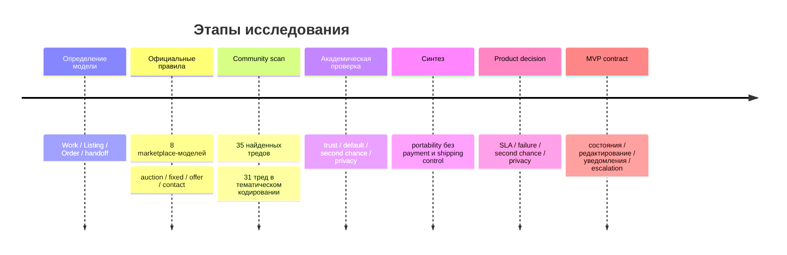
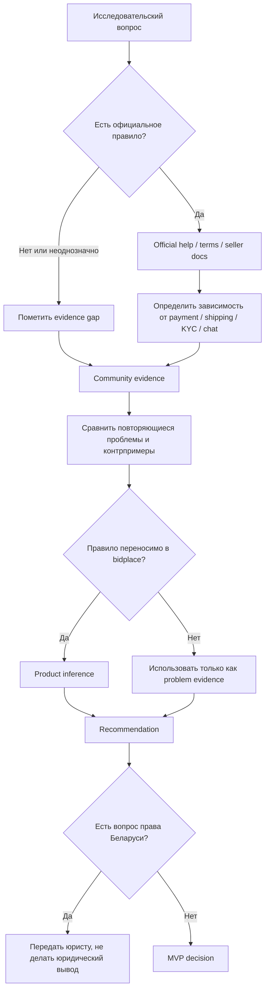
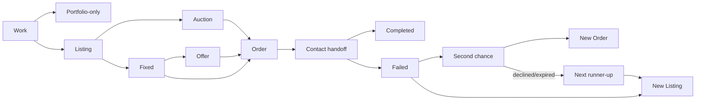

# Глубокое исследование механик creator-commerce для первого публичного MVP bidplace

## Резюме, исследовательские вопросы и методика

Тема в текстовом сообщении действительно не была названа, однако приложенный бриф однозначно задаёт предмет исследования: правила первого публичного MVP **bidplace** — площадки для показа и прямой продажи авторских физических работ, где `Work` отделён от `Listing`, `Order` фиксирует договорённость, а оплата и передача происходят вне платформы. Поэтому ниже исследуется именно этот продуктовый контур. fileciteturn0file0

### Короткий вывод

**Рекомендация:** строить bidplace не как «облегчённый eBay без оплаты», а как **marketplace of record + structured handoff**: платформа должна достоверно фиксировать, *что* было предложено, *кому*, *по какой цене и правилам*, кто получил право на сделку и чем закончилась попытка, но не притворяться, что она способна автоматически определить факт оплаты или передачи, которых она не наблюдает.

Из этого следуют основные решения.

**Рекомендация.** Пять минут на связь неприемлемы. Целевой SLA первого действия разумно поставить **24 часа**, через **48 часов** считать контакт просроченным, а возможность закрыть Order как не состоявшийся давать не по одному таймеру, а после структурированного заявления о молчании и последнего окна на возражение; практический предел такого процесса — около **72 часов от Order**. Это заметно быстрее eBay/BidBaits, но не пытается перенести сроки оплаты с платформ, которые видят платёж, на bidplace, который его не видит. eBay даёт покупателю четыре дня на оплату; BidBaits советует напомнить после трёх дней и рассматривает семь дней без контакта/оплаты как основание считать транзакцию незавершённой; Saatchi Art подключает поддержку при отсутствии реакции художника уже примерно через сутки, но сама продажа к тому моменту оплачена. citeturn1search2turn6search2turn9search4

**Рекомендация.** Timeout сам по себе **не должен освобождать Work и создавать новую сделку**. У eBay и Catawiki автоматизация безопаснее именно потому, что платформы видят платежи: eBay может отменять неоплаченный заказ после четырёх дней, а Catawiki — после своего платёжного дедлайна передавать возможность второму/третьему участнику. У bidplace такой телеметрии нет, поэтому автоматическое «он не ответил → вещь свободна» создало бы риск двойной продажи. citeturn1search2turn5search1

**Рекомендация.** Встроенный чат можно отложить. Но его отсутствие должно быть компенсировано **журналом событий Order, явным раскрытием контакта, гарантированными transactional notifications, reason-coded problem flow и возможностью приложить доказательство при споре**. BidBaits показывает, что off-platform handoff практически возможен, но одновременно демонстрирует недостаток такого решения: для разбирательств сервис считает свою внутреннюю переписку более надёжным доказательством, чем WhatsApp/Viber. Etsy также прямо связывает внутренние Messages с возможностью рассматривать case. citeturn6search7turn6search4turn3search15

**Рекомендация.** Контакты нельзя отдавать всем bidders. Контакт становится доступен **только сторонам конкретного Order**, а раскрывается пользователю по явному действию «Показать контакт». Это одновременно реализует handoff и создаёт ценный timestamp: платформа знает, видел ли пользователь данные второй стороны. eBay ограничивает передачу персональных контактов до успешной сделки и запрещает использовать свои сообщения для обхода платформы до транзакции; Catawiki открывает связь между сторонами после продажи/оплаты, но не предоставляет продавцу контакты аудитории торгов. citeturn2search1turn5search4

**Рекомендация.** После подтверждённого buyer-side failure использовать **строго упорядоченный second chance: runner-up → следующий runner-up**, по одному предложению одновременно, с ценой, соответствующей последней действительной ставке конкретного участника. Продавец может выбрать *режим* «second chance» или «новый Listing», но не произвольного bidder. eBay допускает second-chance offer невыигравшим участникам, а Catawiki использует очередь второго/третьего bidder; экономическая литература предупреждает, что сама доступность second chance влияет на bidding incentives, поэтому правило должно быть заранее определено, а не зависеть от желания продавца после результата. citeturn1search9turn5search1turn22search7

**Рекомендация.** Не требовать двухстороннего подтверждения для каждого низкорискового события. Для `Связались` достаточно unilateral marker; для `Передача завершена` и особенно `Сделка не состоялась` нужен режим **action → notice → confirmation/objection → auto-resolution либо admin escalation**. Это предотвращает вечные «зависшие» Order, но не позволяет одной стороне незаметно переписать результат.

**Рекомендация.** Бессрочный fixed Listing сохранять. Не вводить искусственный срок ради сходства с classifieds; вместо этого позднее можно добавить мягкий availability check. Saatchi Art отдельно различает sold/not-for-sale и даже позволяет оставлять проданные вне платформы работы в портфолио, что поддерживает уже принятое bidplace разделение `Work` и попытки продажи. citeturn9search0turn9search10

### Проверяемые гипотезы

Исследование сводилось к пяти гипотезам.

| Измерение | Гипотеза | Итог |
|---|---|---|
| Социальное | Чем жёстче и короче timeout, тем быстрее освобождается Work, но тем выше риск наказать добросовестного покупателя за нормальную задержку | **Поддержана частично:** нужны быстрые reminders, но пяти минут явно недостаточно; платформы дают часы/дни, а community регулярно жалуется даже при многодневных сроках. citeturn18search9turn6search2 |
| Техническое | Аукцион можно запустить без чата, если существует хороший audit trail | **Поддержана с оговоркой:** handoff без встроенного платежа возможен, но доказательность спора становится хуже. citeturn6search7turn6search4 |
| Экономическое | Second chance уменьшает потерю ликвидности после default | **Поддержана**, но литература показывает побочный эффект на bidding incentives; значит, очередь и цена должны быть предсказуемыми заранее. citeturn22search7turn5search1 |
| Privacy | Раскрытие всех bidders продавцу приносит мало операционной пользы и создаёт pressure/off-platform leakage | **Поддержана сравнением практик:** проверенные крупные площадки раскрывают данные участника в контексте состоявшейся транзакции, а не как список лидов. citeturn2search1turn8search14 |
| Operations | Hybrid confirmation — unilateral action с challenge window — масштабируется лучше обязательного двухстороннего подтверждения всего | **Поддержана как продуктовый вывод**, особенно там, где платформа не наблюдает физическое исполнение; автоматическое разрешение безопасно только для низкорисковых событий. citeturn4search4turn21search3 |

### Методика и покрытие

Проверка проводилась **7 сентября 2026 года**. В основную сравнительную выборку вошли восемь сервисов: eBay, Etsy, Catawiki, Whatnot, BidBaits, Kufar, Saatchi Art и Artsy. Приоритет отдавался официальным Help/Terms/Policy/Seller documentation; для меняющихся механик community-ответ не использовался как замена официальной политике. Было просмотрено более пятидесяти официальных справочных и policy-страниц; в итоговый аргумент вошли только те, где механика была достаточно явно описана. citeturn1search2turn3search4turn5search1turn4search5turn6search7turn6search10turn9search8turn8search18

Для общественного мнения было найдено и просмотрено **35 обсуждений**. Четыре треда с недостаточным доступным содержанием использовались только для навигации и не включались в количественное тематическое кодирование. В основной community-синтез вошёл **31 содержательный тред из восьми сообществ**: eBay Community, Etsy Community, r/whatnotapp, r/artbusiness, r/Ebay, r/EtsySellers, r/CraftFairs и r/FacebookMarketplace. Основной временной диапазон — 2024–2026; более старые материалы использовались лишь как контекст. citeturn18search3turn19search16turn20search1turn16search1turn17search0turn14search1turn16search13turn16search10

Язык первичных площадочных источников преимущественно английский; Kufar дал русскоязычный/белорусский региональный контекст. Русскоязычный community-корпус оказался слабее англоязычного, поэтому выводы о поведении именно аудитории Беларуси и России нельзя считать подтверждёнными без отдельного локального интервью/опроса.

В академической части использовались оригинальные publisher pages/DOI-источники SAGE и Wiley. Полноценный систематический экспорт Scopus/Web of Science не проводился; академический обзор носит направленный, а не метааналитический характер. Исследования интернет-аукционов показывают одновременно две вещи: репутация может влиять на цену и поведение, особенно у опытных bidders, но люди способны доверять обещаниям и без развитой reputation system. Это делает решение bidplace отложить рейтинги допустимым для MVP, но не отменяет необходимости сохранять историю событий. citeturn22search0turn22search5turn22search6turn22search9

### Ключевая литература и внешняя аналитика

| Источник | Тип | Что добавляет | Ограничение |
|---|---|---|---|
| Kas, Corten, van de Rijt, 2023 | Peer-reviewed, *Rationality and Society* | eBay-data + эксперимент: доверие к seller promises может существовать даже без сильной reputation mechanism. citeturn22search0 | Не исследует off-platform physical handoff bidplace |
| Engelmann, 2023 | Peer-reviewed, *RAND Journal of Economics* | Second-chance offers решают default, но могут менять ставки и bidder incentives. citeturn22search7 | Экономическая модель не определяет лучший UX |
| Livingston, 2010 | Peer-reviewed, *Economic Inquiry* | Неопытные bidders иначе используют reputation signals, чем опытные. citeturn22search6 | Старые eBay-данные |
| Metzger, 2006 | Peer-reviewed | Privacy/security assurance влияет на trust и готовность раскрывать данные. citeturn22search10 | Общий e-commerce, не creator marketplace |
| eBay Help | Official product policy | Четыре дня на оплату, cancellation, Second Chance Offer, сильные ограничения редактирования после bids/offers. citeturn1search2turn1search9turn2search0 | Автоматизация опирается на встроенный payment stack |
| Catawiki Help | Official product policy | Three-day payment deadline, ordered multi-offer после non-payment, controlled resale. citeturn5search1 | Catawiki контролирует оплату и часть fulfilment |
| Marketplace Pulse, 2025 | Industry analysis | Показывает, что даже крупная creator-oriented marketplace может терять активных sellers; полезно как retention context, но не как доказательство конкретной UX-причины. citeturn22search12 | Вторичный аналитический источник |
| WSJ / Guardian | Reputable news | Показывают, что platform policy/enforcement changes становятся существенным seller-retention фактором и вызывают миграцию части creators. citeturn22news56turn22news48 | Журналистские кейсы не заменяют причинный анализ |

## Официальные механики площадок и переносимость в bidplace

Все механики ниже проверены на **7 сентября 2026 года**. `Н/д` означает не «функции нет», а «в просмотренных официальных документах это не было установлено достаточно надёжно».

| Площадка | Item / quantity / editions | Sale modes | Deadline и cancel | Second chance / relist | Contacts / chat | Editing / completion | Что нельзя прямо переносить |
|---|---|---|---|---|---|---|---|
| **eBay** | Single item и quantity listings; специальная art-edition модель не была предметом проверенных docs | Auction, fixed, offers | Winner/buyer имеет **4 дня** на оплату; после этого seller может cancel, включая auto-cancel. citeturn1search2turn1search4 | Second Chance Offer возможен после non-payment/cancel; seller также может relist. citeturn1search9 | Personal contact до transaction ограничен; успешная transaction меняет допустимый уровень disclosure. citeturn2search1 | После bids/offers резко ограничиваются price, duration, description/item specifics edits. citeturn2search0 | «Не заплатил» eBay знает из собственного payment stack; bidplace — нет |
| **Etsy** | Handmade/creative listings, quantity/variations; auction отсутствует в изученном seller flow | Fixed, custom/reserved flows; negotiation не аналог eBay Best Offer | Seller должен отвечать своевременно; после обращения buyer и ожидания >48h при qualifying problem возможен case. Seller сам выполняет cancellation/refund. citeturn3search4turn3search5turn3search1 | Cancelled sold-out item сам по себе не обязан автоматически возвращаться в sale; listing можно renew. citeturn3search1 | Etsy требует сохранять transaction communication в Messages и запрещает увод transaction с платформы. citeturn3search0turn3search15 | Etsy Payments, refunds, cases и transaction protection делают эту модель существенно более контролируемой |
| **Catawiki** | Curated-object/unique-first модель; массовый quantity flow не основной предмет просмотренных docs | Auction; для части объектов Buy Now может сосуществовать с bidding | Auction buyer обычно должен заплатить в течение **3 дней**; reminders следуют автоматически. citeturn5search1turn5search6 | При multi-offer примерно на 7–9 день opportunity может перейти 2-му/3-му bidder; unsold/cancelled object можно resubmit. citeturn5search1 | Seller получает возможность связаться с buyer в order context; контакты аудитории торгов не раскрываются. citeturn5search4 | Payment release, delivery/inspection и claims опираются на controlled funds/shipping process. citeturn5search9turn5search20 |
| **Whatnot** | Supports individually sold auction/BIN inventory; dedicated art-edition semantics не ключевая часть исследованных docs | Live auctions, Buy It Now | Winning bid обычно **автоматически списывается** с default payment method; buyer cancellation request имеет ограниченное окно, seller получает до 48h на решение. citeturn4search11turn4search0turn4search5 | Не является хорошим аналогом non-payment handoff именно из-за automatic charge | Live chat встроен в live-commerce experience; support доступен через order problem flows. citeturn4search4 | Listing редактируется до активного auction/checkout, затем ограничения усиливаются. citeturn4search6 | Почти вся простота winner→order опирается на payment-on-win |
| **BidBaits** | Lot-oriented marketplace; dedicated editions/stock model в проверенных правилах не установлен | Auctions + fixed price | После sale сервис отправляет сторонам контакты. Seller guidance предлагает reminder примерно через **3 дня**, а после ~7 дней без contact/payment допускает незавершённость/cancellation flow. citeturn6search7turn6search2 | Auto-relist или manual relist после cancel возможны. citeturn6search2 | Это ближайший аналог bidplace: стороны завершают deal напрямую; при disputes внутреннюю correspondence сервис считает более надёжной, чем WhatsApp/Viber. citeturn6search4 | Рейтинг и on-site correspondence частично компенсируют отсутствие controlled payment — bidplace в MVP не имеет обоих |
| **Kufar** | Classified-ad model; art editions не отдельная transaction abstraction | Объявления/fixed negotiation, не классический auction в исследованном flow | Ads со временем деактивируются; seller может самостоятельно deactivate. citeturn6search5turn6search3 | Inactive ad может возвращаться в active | Messaging является частью взаимодействия; при деактивации seller может указать покупателя среди переписывавшихся. citeturn6search15 | **Любое изменение объявления возвращает его на moderation**; первоначальные объявления также проходят human moderation. citeturn6search10turn6search6 | Это classifieds с другим уровнем binding commitment; правило «re-moderate everything» слишком дорого для bidplace |
| **Saatchi Art** | Originals, limited editions с несколькими экземплярами и open-edition prints разведены продуктово. citeturn9search10turn9search7 | Fixed purchase + Make an Offer; не peer-to-peer auction | Artist имеет до **72h** на ответ на offer; при accepted offer card buyer автоматически charged. После оплаченной sale художник обычно организует handoff в следующие дни; support реагирует на отсутствие ответа примерно через 24h. citeturn9search8turn9search4 | Sold elsewhere может оставаться в portfolio, но быть помечено unavailable/sold. citeturn9search0 | Handoff идёт после already-paid order | Seller payout зависит от safe delivery. citeturn9search11 | Offer SLA и fulfilment safeguards опираются на card/payment + shipping |
| **Artsy** | Artwork-centric model, включая auction artworks; edition semantics есть в art ecosystem, но sampled transaction docs главным образом описывают bidding/purchase | Auction, Purchase, Make Offer/Contact Gallery, Sold/Bidding Closed states. citeturn8search1 | Для auction bidder регистрируется с contact/card details; после результата auction house связывается с winner для invoice/payment/shipping; Artsy рекомендует обращаться к specialist, если follow-up не пришёл примерно за 7 дней. citeturn8search12turn8search18 | Transaction остаётся между auction house и winning bidder | Identity verification может выполняться без раскрытия ID другим пользователям. citeturn8search14 | Auction house и bidder vetting создают институциональный слой, которого нет у peer-to-peer bidplace |

### Что сравнительный анализ реально доказывает

**Официальный факт.** Сроки крупных площадок нельзя сравнивать как одну линейку. «Четыре дня eBay», «три дня Catawiki», «72 часа Saatchi» относятся к разным действиям: payment, offer response или fulfilment. У Whatnot winner вообще не получает отдельного многодневного окна оплаты — payment method автоматически charged. citeturn1search2turn5search1turn9search8turn4search11

**Вывод для bidplace.** Поэтому копировать «3 days» или «4 days» буквально неправильно. Событие bidplace — не *payment timeout*, а **communication/handoff readiness timeout**. Его необходимо сделать короче, чем классический unpaid-item window, но слабее по последствиям.

**Официальный факт.** Ограничение редактирования после появления экономического интереса является устойчивым паттерном. eBay разрешает значительно больше до bids/offers и блокирует ключевые изменения после них; Catawiki после expert approval допускает изменения прежде всего для действительно критичной информации и запрещает обычное снятие объекта во время auction, кроме исключительных случаев. citeturn2search0turn5search10turn5search15

**Вывод для bidplace.** Повторная модерация каждого исправления, как у Kufar, слишком тяжела; но «свободно меняем всё до конца торгов» ещё хуже. Нужна классификация изменений на cosmetic, material Work change и transaction-term change.

**Официальный факт.** Second chance у зрелых auction products не означает «продавцу выдать телефон всех bidders». eBay оформляет отдельное предложение конкретному non-winner; Catawiki ограничивает продолжение продажи следующими eligible bidders. citeturn1search9turn5search1

**Вывод для bidplace.** `runner-up` — economic position, а не sales lead.

## Сигналы пользователей, противоречия и ограничения выборки

### Как кодировались обсуждения

В тематический синтез вошёл **31 discussion из восьми сообществ**. Один тред мог получать несколько тегов; поэтому числа ниже нельзя складывать. Это **не статистика пользователей рынка** и не оценка распространённости проблемы — только частота появления проблемы в целенаправленно отобранном qualitative corpus. Community posts имеют сильный self-selection bias: люди чаще пишут, когда что-то сломалось, чем после обычной сделки.

| Тема | Тредов с явным сигналом | Сообществ | Визуально |
|---|---:|---:|---|
| Новому/малому seller трудно получить первые продажи или visibility | 9 | 4 | █████████ |
| Seller cancellation, low-price refusal, misattributed cancellation | 8 | 3 | ████████ |
| Ghosting / non-payment / no-response deadline | 7 | 4 | ███████ |
| Messaging/notification/contact friction | 5 | 3 | █████ |
| Нужен human support / escalation | 5 | 3 | █████ |
| Privacy/off-platform scam pressure | 3 | 3 | ███ |
| Second-chance/relist collision | 3 | 2 | ███ |

Корпус включает, среди прочего, eBay seller discussions о non-paying auction winners, low-price cancellation и collision между automatic relist и Second Chance Offer; Etsy seller discussions о ненадёжной доставке Messages, scam outreach и отсутствии ответа клиента; Whatnot — об auction pressure, cancellation и support; artbusiness — о трудностях первых продаж. citeturn18search9turn18search12turn18search0turn19search2turn19search17turn20search0turn16search1

### Повторяющиеся сигналы

**Сигнал сообщества: waiting без понятного конца раздражает обе стороны.** В eBay Community есть одновременно жалобы на four-day payment window как слишком долгий и кейсы, где продавцы дают дополнительное время, пытаются связаться, а buyer всё равно исчезает. Это не доказывает, что четыре дня объективно неправильно; оно показывает, что пользователю важны **предсказуемая escalation point и возможность двигаться дальше**. citeturn18search3turn18search9turn18search14

**Контрпример:** слишком короткий срок также несправедлив. BidBaits специально советует учитывать time zones/weekends и сначала попытаться связаться; Saatchi Art отделяет быстрый support escalation от немедленного признания sale failed. citeturn6search4turn9search4

**Сигнал сообщества: attribution of fault важнее простой кнопки Cancel.** В свежем r/Ebay кейсе seller, который double-sold item, просил buyer самому запросить cancellation; большинство участников интерпретировало это как попытку избежать seller-side consequences. В eBay Community регулярно появляются аналогичные complaints о seller cancellation после слишком низкого auction result. citeturn17search0turn18search0turn18search1

**Вывод для bidplace.** `Failed` без reason/initiator превращает историю в мусор. Нужно хранить, кто инициировал outcome и какое основание выбрано, даже если в MVP нет публичного рейтинга.

**Сигнал сообщества: seller refusal из-за низкой цены — реальная проблема, а не теоретический edge case.** В eBay Community неоднократно описываются auctions, после которых seller cancels/ends/re-lists, потому что цена оказалась ниже ожидаемой; community прямо советует seller начинать auction с цены, которую он действительно готов принять. citeturn18search1turn18search8turn18search13

**Вывод для bidplace.** Кнопка «не состоялась» не должна стирать факт, что именно seller отказался исполнять результат. Иначе seller получает бесплатную опцию: оставить высокий результат и отменить низкий.

**Сигнал сообщества: more communication ≠ better experience.** Etsy seller discussions одновременно содержат противоположные проблемы: потенциально реальные buyer messages могут уходить в spam, но лишние post-purchase messages могут восприниматься как intrusive. citeturn19search2turn19search16

**Вывод для bidplace.** MVP не нужен «notification center ради notification center». Нужны несколько **обязательных transactional events**, которые не теряются среди social activity.

**Сигнал сообщества: self-service хорошо работает для однозначных кейсов, но пользователи хотят человека при нестандартном конфликте.** В Whatnot community есть и жалобы на невозможность добиться human resolution, и контрпримеры почти мгновенных refunds в простых documented cases. Whatnot официально также развивает seller-first/self-service support с platform escalation. citeturn20search1turn20search2turn4search4

**Вывод для bidplace.** Администратор не должен подтверждать каждую нормальную сделку; он нужен, когда две стороны утверждают несовместимые факты.

**Сигнал сообщества: auction pressure требует особой осторожности.** В r/whatnotapp пользователи описывают hype-driven bidding, overpayment и buyer regret/cancellation; это характерно для live commerce и не переносится один к одному на обычный timed auction, но показывает риск интерфейса, который намеренно усиливает давление. citeturn20search0

**Этический вывод.** Для bidplace не стоит в MVP добавлять manipulative countdowns, seller callouts конкретным bidders или способы личного давления после окончания auction.

### Противоречие академической литературы

Kas, Corten и van de Rijt обнаружили, что покупатели могут доверять seller promises и без сильного reputation system; более ранние исследования одновременно показывают, что seller reputation способна влиять на valuations, prices/default expectations, а неопытные bidders используют такие сигналы иначе, чем опытные. citeturn22search0turn22search5turn22search6turn22search9

**Вывод для bidplace:** отсутствие рейтинга в первом MVP не является доказанным blocker. Но откладывать рейтинг ≠ выбрасывать историю. Сейчас нужно сохранять данные так, чтобы позднее можно было строить trust signals на достоверных outcome events, а не на реконструкции старых логов.

## Ответы на продуктовые вопросы и проверка предложений основателя

### Ответы на вопросы исследования

1. **Сколько дать на первый контакт?**  
   **Рекомендация:** обозначить **24 часа как ожидаемый срок первого действия**, после 24h отправлять reminder; после **48h** показывать `Контакт просрочен`; примерно на **72h** разрешать завершить no-response flow, если контрагент инициировал проблему и в последнем окне другая сторона не возразила. Не использовать пять минут. Этот диапазон отделяет urgency от failure determination: Saatchi может начинать follow-up через 24h, но eBay/Catawiki/BidBaits дают дни на irreversible payment/default consequences. citeturn9search4turn1search2turn5search1turn6search2  
   **Статус:** evidence-informed product recommendation, не «рыночный стандарт».

2. **Timeout только отмечает просрочку или автоматически признаёт failure?**  
   **Рекомендация:** первый timeout **только ставит overdue и запускает reminder**. Более поздний timeout может разрешить стороне *инициировать* failure, но не должен сам освобождать Work. Автоматически закрыть no-response case допустимо только после notice/challenge window и отсутствия любого признака активности другой стороны. eBay/Catawiki могут использовать более жёсткую автоматику потому, что видят payment state. citeturn1search2turn5search1

3. **Можно ли аукцион без внутреннего чата?**  
   **Рекомендация:** **да, для MVP**. После Order сторонам показывается выбранный внешний контакт, а bidplace сохраняет transaction record. Но без чата необходимо иметь: contact-reveal event, structured outcomes, reminders, problem reason, evidence upload при споре и admin decision record. BidBaits подтверждает жизнеспособность direct handoff, одновременно показывая, насколько внутренний communication log полезен при dispute. citeturn6search7turn6search4

4. **Кто отмечает `Связались`, `Передача завершена`, `Сделка не состоялась`?**  
   **Рекомендация:** `Связались` — **любая сторона unilateral**, без освобождения Work. `Передача завершена` — одна сторона инициирует, другая получает confirm/dispute; если молчит достаточно долго, можно auto-complete с сохранением «не подтверждено второй стороной». `Сделка не состоялась` — любая сторона инициирует с reason; mutual agreement закрывает сразу, unilateral failure проходит objection window. Платформа самостоятельно не утверждает физический факт только по timeout.

5. **Как автоматизировать обычные случаи?**  
   **Рекомендация:** straight-through automation для mutual completed, mutual failed, uncontested no-response и expired second-chance offers. Администратору отправлять только contradictory outcomes, seller-refusal disputes, repeated abuse, evidence conflict, disputed loss/damage и unusually long unresolved Order. Такой seller/self-service-first подход похож на часть Whatnot support model, но без автоматического refund, которого bidplace сделать не может. citeturn4search4turn21search3

6. **Что делать после confirmed non-buyout?**  
   **Рекомендация:** seller выбирает **одну из двух mutually exclusive веток**: `Second chance` или `New Listing`. Second chance идёт строго по ranked queue, одному bidder за раз; после decline/expiry — следующему. Arbitrary bidder selection не разрешать. eBay и Catawiki подтверждают продуктовую жизнеспособность second chance, а академическая работа показывает, почему условия должны быть заранее известны bidders. citeturn1search9turn5search1turn22search7

7. **Получает ли seller контакты всех auction participants?**  
   **Рекомендация:** **нет**. Seller должен видеть bidding history в необходимой для auction форме, но персональные contact details — только у стороны действующего Order. Массовое disclosure превращает auction participant list в sales lead database, повышает риск давления, side deals и privacy leakage. Проверенные eBay/Catawiki/Artsy flows не дают seller аналогичного общего списка контактов. citeturn2search1turn5search4turn8search14

8. **Automatic contact reveal или отдельное действие?**  
   **Рекомендация:** **контакт становится доступен автоматически, но значение раскрывается только после `Показать контакт`**. На экране до нажатия видны channel и правило «кто пишет первым». Click фиксируется. Это минимальный privacy-by-default механизм и одновременно diagnostic signal: «не писал» отличается от «даже не открыл контакт». Исследования e-commerce privacy подтверждают, что механизмы assurance и control влияют на willingness to disclose. citeturn22search10

9. **Что можно редактировать и когда?**  
   **Рекомендация:** до публикации — всё; после moderation — cosmetic edits свободнее material edits; scheduled/live auction после первого bid замораживает economic terms и material Work facts; pending fixed offer замораживает цену/условия до решения по offer; Order имеет immutable transaction snapshot. eBay и Catawiki подтверждают общий принцип усиления ограничений после bids/review. citeturn2search0turn5search15 Подробная матрица — ниже.

10. **Как назвать portfolio/hidden/withdrawn/unsold/sold?**  
    **Рекомендация:** не создавать один status `Архив`. Развести как минимум **visibility**, **availability** и **sale outcome**. Пользовательские labels: `В портфолио`, `На продаже`, `Скрыта`, `Снята с продажи`, `Не продана`, `Сделка не состоялась`, `Продана через bidplace`, `Продана вне bidplace`. Saatchi Art явно поддерживает различие «работа остаётся в портфолио, но продана/недоступна», включая sale elsewhere. citeturn9search0

11. **Какие immutable facts нужны Order?**  
    **Рекомендация:** source/mode; Work/Listing snapshot; parties; price/currency; auction result или accepted offer; timestamps; seller-chosen first-contact rule; displayed handoff terms; contact-reveal timestamps; applicable rules/version; all outcome claims/confirmations; failure reason/initiator; notification delivery attempts; admin resolution; lineage to predecessor failed Order/second chance. Не проектировать это как БД — это product record.

12. **Как сохранить путь к editions, quantity, presale?**  
    **Рекомендация:** не кодировать бизнес-правило «у Work навсегда может быть ровно один Order». Для MVP правило должно звучать уже: `уникальная Work имеет одну доступную sale unit`. Listing остаётся отдельной попыткой продажи; Order ссылается на immutable offered unit. Позднее limited editions/quantity смогут дать Work несколько sale units без разрушения Listing/Order abstraction. Saatchi уже показывает полезность разведения original, limited edition и open edition. citeturn9search10turn9search7

13. **Минимальный self-service flow проблемы сделки?**  
    **Рекомендация:** `Есть проблема → выбрать reason → короткие уточняющие поля → что это действие сделает/не сделает → submit → уведомить вторую сторону → confirm/contest → automatic outcome либо admin`. Ни одна первая кнопка проблемы не должна мгновенно unlock Work. Это особенно важно для seller-side `Не устраивает цена`, buyer-side `Не отвечает` и disputed `Не заплатил`.

14. **Можно ли отложить notification center?**  
    **Рекомендация:** **да**. Но нельзя откладывать reliable transactional delivery. Обязательные события: Order created; auction won для winner и seller; accepted offer; fixed purchase; «вы должны написать первым»; 24h reminder; overdue contact; failure claim + objection deadline; second-chance offer/expiry/acceptance; completion confirmation; material auction cancellation. Etsy community показывает реальную цену lost messages, а платформы вроде Catawiki отдельно отправляют auction/result notifications. citeturn19search2turn5search2

### Проверка предложений основателя

| Спорный вариант | Рекомендуемый вариант | Почему | Сильнейший контраргумент | Зависимость | Доказательность | Юрист Беларуси |
|---|---|---|---|---|---|---|
| **Пять минут на связь** | **Отклонить**; 24h target / 48h overdue / ~72h no-response resolution | 5 min измеряет push-notification latency, а не willingness to transact; peer marketplaces используют существенно более длинные окна. citeturn1search2turn6search2turn9search4 | Очень дорогой/горячий auction может требовать быстрой связи | Notification reliability | **Средне-сильная** | Нет для UX SLA; да, если timeout меняет юридические последствия |
| **Открывать seller всех bidders** | **Нет** | Privacy, pressure, off-platform bypass; контакты нужны только Order parties. citeturn2search1turn8search14 | Seller мог бы быстрее найти резервного buyer | Не зависит от payment | **Сильная по pattern, средняя causal** | **Да**, по персональным данным |
| **Seller выбирает любого следующего buyer** | **Нет; ranked queue** | Предотвращает cherry-picking и post-auction renegotiation | eBay даёт seller некоторую свободу Second Chance Offer. citeturn1search9 | Нет | **Средняя**; theory подтверждает incentive sensitivity. citeturn22search7 | Возможен вопрос binding auction |
| **Chat обязателен для первого auction** | **Нет** | Off-platform handoff возможен; structured log дешевле для MVP. citeturn6search7 | Без чата хуже evidence при dispute. citeturn6search4 | Требует хороших notifications/evidence upload | **Средняя** | Да, по доказательствам/retention |
| **Timeout автоматически разрешает новую сделку** | **Нет** | Platform не знает, произошла ли внешняя связь/оплата | Сильно уменьшает stuck inventory | eBay/Catawiki могут это делать благодаря payment telemetry. citeturn1search2turn5search1 | **Сильная inference** | **Да** |
| **Automatic contact reveal** | **Нет; reveal-on-click** | Data minimization + timestamp | Один дополнительный click добавляет friction | Требует reliable Order page | **Средняя** | **Да** |
| **Two-party confirmation всего** | **Hybrid** | Полная mutual confirmation создаёт stuck states; чистая unilateral — abuse | Простая two-party схема понятнее | Notifications + challenge windows | **Средняя** | Да для юридически значимых outcomes |
| **Бессрочный fixed Listing** | **Сохранить** | Соответствует art portfolio model; expiry не нужен как бизнес-событие | Stale listings снижают доверие | Availability reminders | **Средняя**; Saatchi использует periodic freshness concepts. citeturn9search1turn9search10 | Нет, кроме disclosure obligations |
| **Portfolio/archive/sold одним статусом** | **Отклонить** | Смешивает visibility, sale history и ownership outcome | Одна кнопка проще в UI | Нет | **Сильная продуктовая логика**, поддержана Saatchi. citeturn9search0 | Нет |
| **Re-moderate после любого edit** | **Отклонить**; только material changes | Kufar показывает такую модель, но auction fairness требует скорее freeze критичных полей, чем полную повторную moderation каждого typo. citeturn6search6turn2search0 | Универсальное re-review проще как policy | Moderator capacity | **Средняя** | Возможны категории, где закон потребует review |

## Рекомендуемая модель MVP и операционные матрицы

### Минимальный end-to-end flow

**Обычная успешная сделка.** Auction ends / fixed purchase / seller accepts offer → создаётся Order и Work блокируется → обе стороны получают transactional notification → designated first mover нажимает `Показать контакт` и пишет → любая сторона отмечает `Связались` → после handoff одна сторона нажимает `Передача завершена` → другая подтверждает; при отсутствии objection после установленного окна Order auto-completes как `Completed — confirmation timeout`, сохраняя, что active confirmation второй стороны не было.

**Молчание одной стороны.** 24h reminder → 48h `Контакт просрочен` → активная сторона выбирает `Не выходит на связь` → silent party получает final notice → отсутствие objection/activity до ~72h позволяет закрыть как `Failed: no response` и только после этого unlock Work.

**Согласованный срыв.** Одна сторона выбирает reason, например `Передумали по взаимному согласию`; вторая подтверждает → Order закрывается immediately → Work получает eligibility для relist.

**Спор.** Одна сторона заявляет failed, вторая нажимает `Не согласен` → Work остаётся locked → admin получает immutable snapshot + claims + evidence. До решения нельзя создать competing Listing.

**Отказ seller из-за низкой цены.** Seller может честно выбрать `Не готов передать по результату торгов`, но это **seller-side failed outcome**, а не нейтральный cancel. Buyer получает notice. История auction остаётся. Relist не должен переписывать этот факт; repeated pattern можно позднее использовать как trust/abuse signal. Community evidence показывает, почему neutral cancel здесь опасен. citeturn18search0turn18search1

**Buyer отказался или недоступен.** `Buyer declined` либо unchallenged `Buyer no response` → failed buyer-side → seller получает выбор `Second chance`/`New Listing`.

**Work повреждена или утрачена.** Seller заявляет `Повреждена/утрачена` → Order не превращается автоматически в обычный relistable failure. Work становится `Unavailable`; если затем восстановлена/найдена, seller должен явно вернуть availability, а material condition change пройти moderation.

**Runner-up принимает.** После окончательного failed original Order система предлагает item следующему eligible bidder. До ответа Work locked в `Second chance pending`. Acceptance создаёт **новый Order и новый deal code**, связанный с исходным Listing и failed predecessor. Это не восстановление старого Order и не fake bid.

**Runner-up отклоняет/не отвечает.** Предложение expires → никакого failed Order для него создавать не нужно, если он не принял предложение; система переходит к следующему runner-up либо возвращает seller выбор `continue / relist`.

**Second chance против relist.** Они mutually exclusive. Пока active second-chance offer существует, новый Listing создать нельзя. Именно такой collision появляется у eBay sellers, когда automatic relist и Second Chance Offer существуют одновременно для одной unique item. citeturn18search12turn18search6

### Матрица состояний и редактирования

`Material Work fields` здесь означают факты, способные изменить решение buyer: identity/authorship, physical condition, originality/edition nature, dimensions/materials, provenance/authenticity claims, ключевые изображения и существенное описание состояния.

| Стадия | Work content | Price / sale terms | Photos | Listing schedule | Что происходит с интересом buyers | Re-moderation |
|---|---|---|---|---|---|---|
| **Draft** | Свободно | Свободно | Свободно | Свободно | Нет | Только при submit |
| **На модерации** | Edit = снять текущую submission и переслать | Свободно до повторного submit | Свободно | Можно | Нет | **Да**, после edit |
| **Approved, portfolio-only** | Cosmetic — да; material — да с review | Н/п | Add/replace | Н/п | Нет | Только material |
| **Scheduled auction** | Cosmetic — да; material — review | До старта допустимо по policy; фиксировать change history | Add; removal material image — review | До старта, но существенный перенос показывать явно | Bids ещё нет | Material Work change — да |
| **Live auction, 0 bids** | Только безопасные cosmetic edits; material change лучше cancel/pause | Не менять start/step после начала | Add clarifying photo; не удалять ключевые | End time не менять, кроме platform emergency | Нет bidder reliance, но auction уже публичный | Material change → stop/review |
| **Live auction, ≥1 bid** | Core snapshot **frozen** | **Frozen** | Только add clarification, без удаления исходных | **Frozen** | Есть reliance | Material correction → cancel auction с reason, review, новый Listing |
| **Active fixed, 0 offers** | Cosmetic — да; material → review | Price/terms можно менять с timestamp | Можно | Бессрочный | Нет open offer | Material Work change |
| **Active fixed, open offer** | Core snapshot frozen до resolution offer | **Frozen до accept/decline/expire** | Только non-material add | Н/п | Есть экономическое предложение | Material change → close offers/review |
| **Order** | Публичную portfolio narrative можно позже править, но **Order snapshot immutable** | Immutable | Snapshot immutable | Н/п | Agreement создан | Нет редактирования Order |
| **Failed** | Work отдельно может обновляться | Старый Order immutable; новый Listing получает новые terms | Новая condition может потребовать review | Новый Listing | История сохраняется | По material changes |
| **Completed** | Portfolio story может развиваться | Transaction facts immutable | Transaction snapshot immutable | Нельзя re-list unique unit | Sold | Только если меняется публичный moderated content |

Такой подход строже Etsy, где published listing в целом остаётся редактируемым, и ближе к auction logic eBay/Catawiki, где bid/review существенно уменьшает допустимость изменений. citeturn3search6turn2search0turn5search15

**Повторная модерация должна срабатывать не по факту любого edit, а по semantic risk.** Kufar действительно отправляет изменённое объявление на новую moderation, но для bidplace это неоправданно превратит исправление punctuation в moderator workload; при этом изменение condition/authenticity во время auction слишком серьёзно, чтобы просто «отправить на review, пока bids продолжаются». citeturn6search6turn6search10

### Taxonomy без «Архива»

Рекомендуется хранить три независимых смысла и уже из них строить labels.

| Ось | Значения MVP | Что означает |
|---|---|---|
| **Visibility Work** | Draft / Moderation / Published / Hidden | Видна ли сама работа |
| **Current availability** | Portfolio-only / Listed / Order-locked / Unavailable | Можно ли сейчас начать новую продажу |
| **Historical outcome** | No sale yet / Listing withdrawn / Listing unsold / Order failed / Sold via bidplace / Sold elsewhere | Что фактически произошло |

Пользователь видит естественные формулировки: **«В портфолио»**, **«На аукционе»**, **«Продаётся»**, **«Скрыта»**, **«Снята с продажи»**, **«Не продана»**, **«Сделка не состоялась»**, **«Продана через bidplace»**, **«Продана вне bidplace»**. Saatchi Art — сильный отраслевой пример того, что sold work имеет смысл сохранять как portfolio artifact и отдельно обозначать sale elsewhere. citeturn9search0

### Матрица abuse, privacy и admin workload

| Риск | Без защиты | Минимальная защита MVP | Кто решает | Автоматически освобождает Work? |
|---|---|---|---|---|
| Seller не доволен низкой auction price | Cancel → relist → auction становится необязательным | Reason-coded seller refusal + immutable history | Self-service; admin только при dispute/repeat | **Нет мгновенно** |
| Buyer ghosting | Work зависает навсегда | 24/48/72 escalation + final notice | Auto if uncontested | После завершения process |
| False «buyer не отвечает» | Seller получает двойную продажу | Contact reveal log + challenge window | Auto/admin | Нет до window |
| False «передача завершена» | Искажён sold history | Confirm/dispute | Auto if uncontested | Н/п |
| All-bidder contact reveal | Harassment / pressure / bypass | Только current Order parties | System | Н/п |
| Seller double-sells elsewhere | Buyer теряет expected deal | Seller-side `Unavailable/sold elsewhere` reason, immutable history | Self-service + repeat-abuse review | Да после proper closure, но unique Work становится sold/unavailable |
| Повреждение Work | Seller может скрыть inconvenient price под «damage» | Separate reason + buyer notice + Work unavailable | Admin только если contested | **Не делает Work relistable** |
| Second chance + relist одновременно | Два потенциальных buyers | Mutual exclusion lock | System | Н/п |
| Runner-up cherry-picking | Seller обходит auction ranking | Ordered queue | System | Н/п |
| Abuse кнопки «проблема» | Moderator flood | Structured reason + action-specific rules | System → admin only on conflict | Обычно нет |

### Неизменяемые факты общей записи сделки

Продуктовая запись `Order` должна сохранять:

1. **Происхождение agreement:** auction win, fixed purchase, accepted offer или accepted second chance; для second chance — ссылка на исходный Listing и predecessor failure.
2. **Work snapshot:** название/автор, изображения/состояние и остальные material facts в том виде, в котором buyer принял экономическое решение.
3. **Listing snapshot:** sale mode, auction start/step/times либо fixed price; relevant handoff conditions.
4. **Стороны:** стабильные platform identities seller/buyer и тот disclosure, который был показан в момент сделки.
5. **Экономические факты:** agreed price, currency, winning/effective bid либо accepted offer amount. Не изменять их задним числом.
6. **Deal identity:** Order ID/deal code и creation timestamp.
7. **Communication contract:** кто по условиям должен написать первым, какой channel был выбран seller, когда каждая сторона нажала `Показать контакт`.
8. **Rule snapshot:** версия applicable marketplace rules и важные seller-specific conditions, которые buyer видел до bid/purchase.
9. **Progress facts:** `Связались`, completion claim, confirmations, objection timestamps.
10. **Failure facts:** initiator, structured reason, statement второй стороны, timeout/notices и итог.
11. **System delivery evidence:** какие critical notifications были поставлены в delivery channel и какой результат доставки известен.
12. **Admin interventions:** кто/когда принял решение и какая категория основания применена.

Это принципиально отличается от попытки «обновлять один status»: новая информация добавляет историю, а не переписывает старую.

## Границы развития, решения основателя, право и этика

### Что оставить после MVP

**Internal chat.** Отложить. Его будущая ценность — прежде всего evidence, anti-spam controls, structured attachments и снижение leakage контактов, а не сама возможность «написать привет».

**Reviews/ratings.** Отложить UI, но уже сейчас собирать reliable outcome history. Академическая литература не даёт основания считать rating обязательной предпосылкой каждой online transaction, но показывает его потенциальное влияние на доверие/цену и различия между novice/experienced users. citeturn22search0turn22search6

**Notification center.** Отложить inbox/UI. Delivery engine критических событий — не откладывать.

**General reports about Work/author.** Оставить после MVP, кроме policy-critical moderation entry point, если он необходим оператору. Transaction-specific `Есть проблема со сделкой` нужен сейчас.

**Multiple quantity / inventory.** Не реализовывать.

**Editions.** Не реализовывать commerce logic, но разрешить Work иметь descriptive fact «уникальная» сейчас без hardcoded assumption, что физически возможен лишь один transferable unit во всей будущей модели.

**Presale / made-to-order.** Не маскировать под нынешний fixed Listing. Это другой fulfilment contract: buyer принимает договорённость до существования готового unique item. Реализовывать отдельно позднее.

### Граница, сохраняющая editions / quantity / presale

Текущий MVP может использовать правило:

> **Каждый Listing bidplace MVP предлагает ровно одну доступную физическую sale unit. Unique Work имеет одну такую unit.**

Это лучше, чем архитектурное утверждение «каждый Work может быть продан ровно один раз навсегда». Позже:

`Work → Edition / production definition → sale units → Listings → Orders`

может появиться без изменения сегодняшнего смысла Listing и Order. Saatchi Art демонстрирует реальную продуктовую необходимость различать original, limited editions с количеством и open-edition/on-demand objects. citeturn9search10turn9search7

Presale при этом должен расширять **availability/fulfilment model**, а не auction semantics.

### Решения, которые основателю стоит зафиксировать после research gate

Для D01–D03 я бы зафиксировал следующий contract:

**Контакт:** 24h expected → 48h overdue → примерно 72h до uncontested no-response closure; exact timers должны быть configurable, а не зашиты в copy.

**Privacy:** contact available only to current Order parties; value reveal on click; никакого bidder directory.

**Auction integrity:** после первой ставки material facts/economic terms frozen; seller refusal after low price не neutral cancel.

**Outcome:** actions append history; Work unlock только после definitive Order outcome.

**Second chance:** ranked, sequential, mutually exclusive with relist; новый accepted second chance = новый Order.

**Fixed:** indefinite; seller может снять только пока Order не создан; open offer block/freeze применяется к конфликтующим economic edits.

**Chat:** не MVP.

**Notifications:** critical delivery — MVP.

**Moderation:** field/risk-based, не «каждый edit».

**Taxonomy:** Work visibility, availability и historical sale outcome — разные оси.

**Admin:** exception handler, а не обязательная сторона normal transaction.

### Вопросы, которые обязательно передать белорусскому юристу

Ниже именно **вопросы**, а не юридические выводы.

**Нужен юрист Беларуси:** в какой момент при auction/fixed/accepted offer между seller и buyer с точки зрения белорусского права возникает юридически значимое обязательство: при bid, окончании auction, создании `Order`, раскрытии контактов либо только при отдельной договорённости сторон?

**Нужен юрист Беларуси:** можно ли Terms bidplace устанавливать, что winning auction result/accepted offer создаёт обязательство сторон связаться и добросовестно завершить договорённость, если деньги и доставка полностью вне платформы?

**Нужен юрист Беларуси:** какие последствия платформа вправе присваивать seller-side refusal и buyer-side non-buyout; допустимы ли account restrictions, cooling periods и публичные/непубличные trust signals без отдельного dispute proceeding?

**Нужен юрист Беларуси:** когда и на каком основании bidplace вправе раскрывать buyer/seller друг другу email, телефон, Telegram/другой contact; нужен ли отдельный consent непосредственно перед disclosure?

**Нужен юрист Беларуси:** какие требования применимы к хранению contact-reveal logs, Order history, dispute evidence и notification delivery records; какие retention periods допустимы/обязательны?

**Нужен юрист Беларуси:** какие требования по локализации, трансграничной передаче и обработке персональных данных действуют при аудитории одновременно в Беларуси и России?

**Нужен юрист Беларуси:** различаются ли обязанности платформы, если seller — обычное физлицо, ремесленник/самозанятый, ИП либо юридическое лицо; что buyer должен видеть о seller status до bid/purchase?

**Нужен юрист Беларуси:** считается ли bidplace в описанной модели электронной торговой площадкой, рекламным посредником, информационным сервисом либо иной категорией, и какие обязательные disclosures/records следуют именно из фактической модели?

**Нужен юрист Беларуси:** какие consumer-protection обязанности нельзя передать seller условиями использования, даже если bidplace не принимает payment и не организует shipping?

**Нужен юрист Беларуси:** может ли система автоматически закрыть Order после notice/challenge period при молчании стороны, и какое значение имеет electronic notification как доказательство?

**Нужен юрист Беларуси:** какие юридические последствия создаёт `Продано вне bidplace` для активного Listing/Order и допустима ли seller-side декларация такого факта без buyer confirmation?

**Нужен юрист Беларуси:** нужны ли отдельные правила для prohibited/restricted artworks/materials, культурных ценностей, age-restricted content и трансграничной передачи таких вещей?

**Нужен юрист Беларуси:** возникают ли у оператора дополнительные AML/KYC, fiscal, receipt/reporting либо payment-related obligations именно из-за auction facilitation, несмотря на отсутствие custody of funds?

### Исследовательская agenda после запуска

Самые полезные данные MVP — не pageviews, а **transaction funnel**: время Order→contact reveal; reveal→`Связались`; доля 24/48/72h timeouts; доля mutual/unilateral failures; failure reason distribution; доля orders, дошедших до admin; second-chance acceptance по position; second-chance→relist conversion; доля seller-low-price refusals; доля Work, ошибочно оказавшихся locked.

Рекомендуемый pilot должен отдельно изучить novice artists. Community discussions r/artbusiness и r/EtsySellers показывают высокий anxiety вокруг первой продажи, visibility и unit economics, но это anecdotal evidence, а не репрезентативная оценка creators Беларуси/России. citeturn16search1turn16search6turn14search1

Потенциальные collaborators: UX researcher с опытом marketplace trust, trust-and-safety practitioner, белорусский e-commerce/privacy lawyer, 15–30 active handmade authors для qualitative council, buyers с опытом art/craft purchases и moderator, который будет реально обрабатывать первые disputes. Финансирование самой research agenda рациональнее сначала держать в founder/product budget или партнёрском pilot budget; конкретные государственные гранты/акселераторы Беларуси следует проверять отдельно на момент подачи, поскольку eligibility и санкционные/регуляторные условия изменяемы.

### Ограничения и этические риски

Главное ограничение — **platform mismatch**. eBay, Etsy, Catawiki, Whatnot и Saatchi наблюдают payment и/или shipping значительно лучше bidplace. Их автоматическая cancellation/refund logic нельзя считать доказательством того, что такой же timeout безопасен без наблюдаемого payment. citeturn1search2turn5search20turn4search11turn9search11

Второе — community self-selection. Жалобы на ghosting, scams и cancellations систематически переотбираются относительно спокойных сделок. Поэтому «7 из 31 тредов» означает лишь повторяемость темы в corpus, а не «22,6% пользователей испытывают ghosting».

Третье — regional gap. Основной community evidence англоязычный. Поведение пользователей, нормы скорости ответа и предпочтительные contact channels в Беларуси/России требуют отдельного исследования.

Четвёртое — **off-platform observability gap**. Даже идеальный UI bidplace не знает, что произошло в звонке, Telegram или при личной встрече. Поэтому продукт должен отличать `сторона заявила X` от `platform verified X`.

Пятое — privacy. Reveal-on-click уменьшает ненужное раскрытие, но не предотвращает сохранение/пересылку контакта после открытия. Это нужно объяснять пользователю честно.

Шестое — auction ethics. Research on inexperienced bidders и community reports о live-auction pressure показывают, что inexperienced users могут вести себя иначе и быть особенно восприимчивыми к контексту торгов. Поэтому interface bidplace не должен искусственно увеличивать urgency сверх реального auction deadline. citeturn22search6turn20search0

## Источники и приложения

### Сравнение шести наиболее значимых источников

| Автор / организация | Год | Тип | Ключевой вывод для bidplace | Ограничение |
|---|---:|---|---|---|
| Engelmann | 2023 | Peer-reviewed economics | Second chance решает проблему default, но влияет на bidding incentives; правило должно быть predictable. citeturn22search7 | Не проектирует конкретный marketplace UX |
| Kas, Corten, van de Rijt | 2023 | Peer-reviewed sociology/economics | Trust может работать даже без ratings; communication itself имеет значение. citeturn22search0 | eBay/experiment ≠ Belarus art marketplace |
| eBay | 2026 check | Official help/policy | 4-day unpaid flow, second chance, restrictions after bids/offers. citeturn1search2turn1search9turn2search0 | Payment is observable |
| Catawiki | 2026 check | Official help | Structured second/third-bidder recovery после payment failure. citeturn5search1 | Payment/shipping ecosystem |
| BidBaits | 2026 check | Official guidance | Самый близкий analogue direct handoff; contacts передаются сторонам, но dispute evidence страдает вне internal correspondence. citeturn6search7turn6search4 | Меньший/менее институционализированный comparator |
| Saatchi Art | 2026 check | Official art-market help | Offer SLA, portfolio/sold-elsewhere taxonomy, originals vs editions. citeturn9search8turn9search0turn9search10 | Payment и fulfilment встроены |

### Официальные страницы — прямые источники

**eBay:** unpaid-item/payment deadline и cancellation. citeturn1search2 Second Chance Offers. citeturn1search9 Listing revision restrictions. citeturn2search0 Member-to-member contact policy. citeturn2search1 Best Offer/payment handling. citeturn1search4

**Etsy:** Off-Platform Transactions policy, обновлённая в 2026 году. citeturn3search0 Seller Policy. citeturn3search4 Contact/case 48-hour flow. citeturn3search5 Listing editing. citeturn3search6 Sale cancellation. citeturn3search1 Messages as transaction evidence. citeturn3search15

**Catawiki:** non-payment и multi-offer. citeturn5search1turn5search6 Removal during auction. citeturn5search10 Post-review editing. citeturn5search15 Seller/order states. citeturn5search4 Payment/delivery control. citeturn5search20

**Whatnot:** auction payment/cancellation logic. citeturn4search11turn4search0 Seller cancellation-response window. citeturn4search5 Listing editing. citeturn4search6 Seller-provided/self-service support. citeturn4search4

**BidBaits:** marketplace/direct-deal model. citeturn6search7 Seller contact/non-response/relist guidance. citeturn6search2 FAQ по cancellation/dispute и correspondence evidence. citeturn6search4 Buyer guidance before bidding. citeturn6search0

**Kufar:** pre-publication human moderation. citeturn6search10 Re-moderation after changes. citeturn6search6 Automatic deactivation. citeturn6search5 Reactivation. citeturn6search3 Buyer identification/review after deactivation. citeturn6search15

**Saatchi Art:** Make an Offer и 72-hour response. citeturn9search8 Sale handoff/support timing. citeturn9search4 Availability check. citeturn9search1 Listing expiry/limited edition behavior. citeturn9search10 Sold elsewhere/portfolio. citeturn9search0 Open editions. citeturn9search7 Payment before seller payout. citeturn9search11

**Artsy:** auction bidder registration. citeturn8search12 Auction transaction mechanics. citeturn8search8 Winner→auction-house follow-up. citeturn8search18 Purchase/Offer/Sold states. citeturn8search1 Identity verification/privacy. citeturn8search14

### Community corpus — прямые обсуждения

**eBay Community — 12 содержательных discussions:** seller cancels after low price. citeturn18search0 Repeated low-bid cancellations. citeturn18search1 Unpaid-order cancellation. citeturn18search3 Automatic unpaid cancellation. citeturn18search5 Relist after non-paying buyer and duplicate-active risk. citeturn18search6 Seller ends auction early. citeturn18search8 Buyer ghosting. citeturn18search9 Bid-cancellation abuse. citeturn18search10 Editing while offers outstanding. citeturn18search11 Second Chance + auto-relist collision. citeturn18search12 Seller cancellation immediately before end. citeturn18search13 Non-paying auction winners. citeturn18search14

**Etsy Community — 5 discussions, вошедших в core coding:** missing buyer messages и off-platform scam red flags. citeturn19search2 Disappearing «orders»/new-seller scams. citeturn19search6 Seller frustration, excessive messaging и customer-contact expectations. citeturn19search16 Personalized order и unresponsive buyer. citeturn19search17 Payment cancellation/support escalation. citeturn19search18

**r/whatnotapp — 4:** seller leaving platform because of support/scam frustration. citeturn16search7 Auction overpayment/pressure/cancellation experiences. citeturn20search0 Positive and negative self-service refund experiences. citeturn20search2 Small-seller difficulty/retention. citeturn21search6

**r/artbusiness — 3:** first art-market sale experience. citeturn16search1 Artist income/platform diversification. citeturn16search3 Young artist struggling to obtain commissions/traction. citeturn16search6

**r/Ebay — 2:** dispute immediately after a seller's first sale. citeturn15search1 Double-sold item and seller asking buyer to initiate cancellation. citeturn17search0

**r/EtsySellers — 3:** seller unit economics and platform feature trade-offs. citeturn14search1 Listing edits/algorithm uncertainty. citeturn14search2 New-seller/scam discussion. citeturn15search0

**r/CraftFairs — 1:** buyer explaining why lack of acknowledgement/contact prevents a sale; useful counterweight to «users hate messages» — buyers want relevant attention, not necessarily more communication. citeturn16search13

**r/FacebookMarketplace — 1:** «no holds», disappearing buyer and disagreement over whether an informal conversation reserved the item. Это особенно полезный пример того, почему bidplace должен явно различать интерес/переписку и настоящий Order. citeturn16search10

### Академические, отраслевые и журналистские источники

Kas, Corten & van de Rijt, **“Trust, reputation, and the value of promises in online auctions of used goods”**, 2023. citeturn22search0

Engelmann, **“Second-chance offers and buyer reputation systems: theory and evidence on auctions with default”**, 2023. citeturn22search7

Livingston, **“The Behavior of Inexperienced Bidders in Internet Auctions”**, 2010. citeturn22search6

Li, **“Reputation, Trust, and Rebates: How Online Auction Markets Can Improve Their Feedback Mechanisms”**, 2010. citeturn22search2

Bruce, Haruvy & Rao, **“Seller rating, price, and default in online auctions”**, 2004. citeturn22search5

Houser & Wooders, **“Reputation in Auctions: Theory, and Evidence from eBay”**, 2006. citeturn22search9

Metzger, **“Effects of Site, Vendor, and Consumer Characteristics on Web Site Trust and Disclosure”**, 2006. citeturn22search10

Marketplace Pulse, **“Etsy Lost 1.4 Million Active Sellers in a Year”**, 2025 — secondary industry analysis, использован только как marketplace-retention context. citeturn22search12

Wall Street Journal, coverage of Etsy leadership/user/GMS changes — macro context, не causal product evidence. citeturn22news56

The Guardian, Etsy seller-policy backlash — qualitative policy-change context. citeturn22news48

### Предлагаемые поисковые строки для независимой перепроверки

Для официальных механик:

`site:ebay.com/help ("buyer hasn't paid" OR "Second Chance Offer" OR "revise listing")`

`site:help.etsy.com ("cancel order" OR "Messages" OR "edit listing" OR "off-platform")`

`site:catawiki.com/en/help ("buyer doesn't pay" OR "second bidder" OR "edit object" OR "contact buyer")`

`site:help.whatnot.com (auction cancellation seller "edit listing" payment)`

`site:bidbaits.com (auction buyer contact cancel relist non-payment)`

`site:kufar.by (модерация объявление изменить деактивировать покупатель)`

`site:support.saatchiart.com ("Make an Offer" OR handoff OR "sold elsewhere" OR edition)`

`site:support.artsy.net (auction winner payment contact identity)`

Для community scan:

`site:reddit.com/r/EtsySellers ("buyer not responding" OR ghosting OR cancel OR "first sale") after:2023-01-01`

`site:reddit.com/r/Ebay ("non paying bidder" OR "seller cancelled" OR "second chance") after:2023-01-01`

`site:reddit.com/r/artbusiness (commission OR selling) (ghosted OR marketplace OR "first sale") after:2023-01-01`

`site:reddit.com/r/whatnotapp (auction cancel OR seller support OR scam OR overpay) after:2023-01-01`

`site:community.ebay.com ("low price" OR unpaid OR "second chance" OR relist)`

`site:community.etsy.com ("not responding" OR messages OR cancel OR buyer)`

Для литературы:

`("online auction" AND default AND "second chance")`

`("online marketplace" AND reputation AND bidder AND trust)`

`("e-commerce" AND privacy AND disclosure AND trust)`

`("auction" AND inexperienced bidders AND reputation)`

### Evidence gaps перед окончательным Work-first contract

Самые важные пробелы — не в количестве конкурентных screenshots, а в четырёх вопросах.

Во-первых, **нет локальных behavioural data Беларуси/России** о том, считается ли 24 часа нормальным ожиданием связи при покупке artwork и какие external channels аудитория реально предпочитает.

Во-вторых, **нет telemetry bidplace**, поэтому 24/48/72 — обоснованная стартовая policy, а не доказанный optimum. Её нужно считать configurable и проверять по реальным `Order→contact` данным.

В-третьих, **юридическая сила auction result/Order для белорусского оператора не исследовалась и намеренно не выводилась из зарубежной market practice**.

В-четвёртых, second chance имеет не только operational benefit, но и возможный effect на bidding strategy; поэтому его нельзя тихо добавить после запуска. Правило queue, price и eligibility должно быть видно **до первой ставки**. citeturn22search7

Итоговый research gate поэтому достаточно определён для продуктового решения: **Work-first модель сохранять; Order делать immutable transaction record; contact — только Order parties и reveal-on-click; 24/48/~72h staged contact flow; pure timeout не освобождает Work; chat и notification center UI отложить, critical notifications — нет; failure делать reason-coded; second chance — ranked и sequential; seller не получает bidder contacts и не выбирает произвольного runner-up; fixed Listing остаётся бессрочным; material edits, а не все edits, запускают moderation/freeze; `portfolio`, `withdrawn`, `unsold`, `failed`, `sold via bidplace` и `sold elsewhere` не объединять в «Архив».** Эти выводы согласуются с конкурентными механиками, community signals и экономикой auction default, но сознательно не переносят payment-dependent automation на площадку, которая не контролирует деньги и доставку. citeturn1search2turn5search1turn6search7turn9search0turn22search7